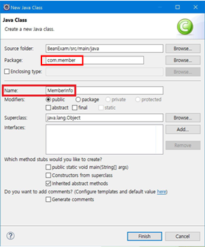
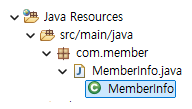
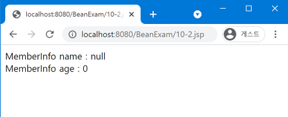
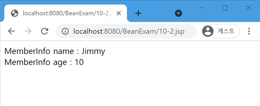
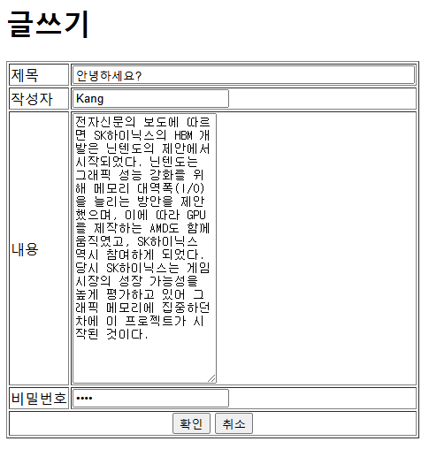
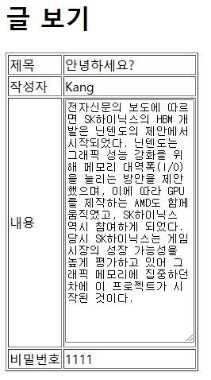

{:toc .large-only}

## 자바빈

- 자바빈 설계 규약(자바빈 API 스펙)에 맞게 만들어진 사용자가 정의한 자바 클래스
- 실행 결과를 생성하는 비즈니스 로직을 구현한 것으로, 실행 결과를 화면에 보여주는 프레젠테이션 로직과 분리할 수 있다.
- 여러 JSP 프로그램에서 자바빈을 재사용할 수 있다.

## 자바빈 설계 규약

- 자바빈 클래스에 생성자를 포함시키려면 파라미터가 없는 기본 생성자가 반드시 정의되어야 한다.
- 자바빈 클래스의 모든 속성에 대해 getter 메서드와 setter 메서드를 정의해야 한다.
  - getter 메서드는 파라미터가 없는 메서드여야 하고 해당 속성의 데이터 타입과 일치하는 리턴 타입을 가져야 한다.
  - setter 메서드는 해당 속성과 데이터 타입이 일치하는 하나의 파라미터를 가져야 한다.

## 자바빈 클래스 생성

1. 프로젝트를 오른쪽 클릭한 후 New→Class 선택
1. Package 항목에 com.member 입력
1. Name 항목에 MemberInfo 입력





> class 파일은 /build/classes/ 폴더에, java 파일은 /src/main/java/ 폴더에 생성됨

## 자바빈 클래스 작성

```java
package com.member;
public class MemberInfo {
	private String name;
	private int age;

	public String getName(){ // name 속성의 getter 메서드
		return name;
	}

	public void setName(String name){ // name 속성의 setter 메서드
		this.name = name;
	}

	public int getAge(){ // age 속성의 getter 메서드
		return age;
	}

	public void setAge(int age){ // age 속성의 setter 메서드
		this.age = age;
	}
}
```

## 자바빈 액션태그

### \<jsp:useBean\>

JSP 페이지에서 자바빈을 사용할 것이라는 선언으로 스크립트 요소에서 사용 가능한 변수가 됨

```jsp
<jsp:useBean id="자바빈이름" class="패키지.클래스이름" scope="범위" />
```

- id: JSP 페이지에서 사용될 자바빈 객체 이름
- class: 자바빈의 유형으로 사용되는 클래스 이름
- scope: 자바빈 객체가 사용되는 범위로 page(기본값), request, session, application 중 하나
  - 사용 범위에 빈이 존재하지 않으면 빈을 생성하며 해당 scope 객체의 속성으로 저장함

| scope 속성 값 | 사용 범위                    |
| ------------- | ---------------------------- |
| page          | 현재 JSP 페이지(기본값)      |
| request       | 최종 포워딩되는 페이지까지   |
| session       | session 객체가 유지될 때까지 |
| application   | 웹 컨테이너가 종료될 때까지  |

#### scope 예시

**10-2.jsp**

```jsp
<%@ page language="java" contentType="text/html; charset=UTF-8" pageEncoding="UTF-8"%>
<!DOCTYPE html>
<jsp:useBean id="meminfo" class="com.member.MemberInfo" scope="page" />
<html>
<head></head>
<body>
<%
	meminfo.setAge(10);
	meminfo.setName("Jimmy");
%>
<jsp:forward page="10-3.jsp" />
</body>
</html>
```

**10-3.jsp**

```jsp
<%@ page language="java" contentType="text/html; charset=UTF-8" pageEncoding="UTF-8"%>
<!DOCTYPE html>
<jsp:useBean id="meminfo" class="com.member.MemberInfo" scope="page" />
<html>
<head></head>
<body>
<%
	out.print("MemberInfo name: " + meminfo.getName() + "<br/>");
	out.print("MemberInfo age: " + meminfo.getAge());
%>
</body>
</html>
```



scope가 page이기 때문에 `<jsp:foward>`를 통해 페이지를 벗어나면 자바빈 객체가 자동으로 삭제된다.

10-2.jsp와 10-3.jsp에서 자바빈 객체의 scope를 request로 변경하면 자바빈 객체의 사용 범위가 최종 포워딩되는 페이지까지로 확장되어 아래와 같은 실행 결과를 얻는다.



### \<jsp:getProperty\>

자바빈 객체의 속성값을 변경한다.

```jsp
<jsp:getProperty name="자바빈이름" property="속성이름" />
```

- 자바빈 객체의 getter 메서드와 대응됨

```jsp
<jsp:getProperty name="meminfo" property="name" />
// 위 코드는 아래와 같은 의미이다.
<% meminfo.getName(); %>
```

### \<jsp:setProperty\>

자바빈 객체의 속성값을 변경한다.

```jsp
<jsp:setProperty name="자바빈이름" property="속성이름" value="속성값" />
```

- 자바빈 객체의 setter 메서드와 대응됨
- `<jsp:useBean>`의 내부에서 사용하면 자바빈 객체가 생성될 때만 실행된다.

```jsp
<jsp:setProperty name="meminfo" property="age" value="10" />
// 위 코드는 아래와 같은 의미이다.
<% meminfo.setAge(10); %>
```

- value 값을 지정하지 않고 파라미터 값을 사용할 수도 있다.

```jsp
<jsp:setProperty name="자바빈이름" property="속성이름" param="파라미터이름" />
// 파라미터이름과 속성이름이 동일하면 param 속성을 생략할 수 있다.
<jsp:setProperty name="자바빈이름" property="속성이름" />
// 모든 속성에 파라미터를 사용
<jsp:setProperty name="자바빈이름" property="*" />
```

## 자바빈을 이용하여 게시판 구현하기

### 자바빈 클래스 만들기

패키지를 com.board로 지정하고 BoardData 클래스를 생성한다.

```jsp
package com.board;

public class BoardData {
	private String title;
	private String writer;
	private String text;
	private String pass;

	public String getTitle() {
		return title;
	}

	public void setTitle(String title) {
		this.title = title;
	}

	public String getWriter() {
		return writer;
	}

	public void setWriter(String writer) {
		this.writer = writer;
	}

	public String getTest() {
		return text;
	}

	public void setText(String text) {
		this.text = text;
	}

	public String getPass() {
		return pass;
	}

	public void setPass(String pass) {
		this.pass = pass;
	}
}
```

### 폼 만들기

**write_form.jsp**

```jsp
<%@ page language="java" contentType="text/html; charset=UTF-8" %>
<html>
<body>
<h1>글쓰기</h1>
<form action="write.jsp" method="post">
	<table border=1>
		<tr><td>제목</td><td><input type="text" name="title" size="50"></td></tr>
		<tr><td>작성자</td><td><input type="text" name="writer"></td></tr>
		<tr><td>내용</td><td><textarea rows="20" name="text"></textarea></td></tr>
		<tr><td>비밀번호</td><td><input type="password" name="pass"></td></tr>
		<tr><td colspan=2 align="center"><input type="submit" value="확인"><input type="reset" value="취소"></td></tr>
	</table>
</form>
</body>
</html>
```



### 응답 페이지 만들기

**write.jsp**

```jsp
<%@ page language="java" contentType="text/html; charset=UTF-8" pageEncoding="UTF-8"%>
<% request.setCharacterEncoding("UTF-8"); %>
<jsp:useBean id="boardData" class="com.board.BoardData" scope="request" />
<jsp:setProperty name="boardData" property="*" />
<jsp:forward page="view.jsp" />
```

property 속성값을 \*로 설정하여 폼을 통해 넘어오는 요청 파라미터들이 자바빈 객체의 속성에 대입된다.

### 결과 페이지 만들기

**view.jsp**

```jsp
<%@ page language="java" contentType="text/html; charset=UTF-8" pageEncoding="UTF-8"%>
<jsp:useBean id="boardData" class="com.board.BoardData" scope="request" />
<!DOCTYPE html>
<html>
<h1>글 보기</h1>
<form action="write.jsp" method="post">
	<table border=1>
		<tr><td>제목</td><td><jsp:getProperty name="boardData" property="title" /></td></tr>
		<tr><td>작성자</td><td><jsp:getProperty name="boardData" property="writer" /></td></tr>
		<tr><td>내용</td><td><textarea rows="20" name="text"><jsp:getProperty name="boardData" property="text" /></textarea></td></tr>
		<tr><td>비밀번호</td><td><jsp:getProperty name="boardData" property="pass" /></td></tr>
	</table>
	<!-- 위 코드는 아래와도 같다. -->
	<!-- <table border=1>
		<tr><td>제목</td><td><%= boardData.getTitle() %></td></tr>
		<tr><td>작성자</td><td><%= boardData.getWriter() %></td></tr>
		<tr><td>내용</td><td><textarea rows="20" name="text"><%= boardData.getText() %></textarea></td></tr>
		<tr><td>비밀번호</td><td><%= boardData.getPass() %></td></tr>
	</table> -->
</form>
</body>
</html>
```


