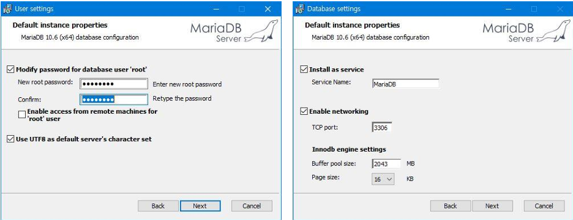
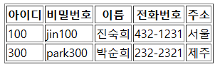

{:toc .large-only}

## 필요한 파일 설치하기

### MariaDB 설치

- https://mariadb.org/download/에 접속하여 MariaDB Server 인스톨러 다운로드
- 인스톨러 설치 및 root 계정 암호 설정
- `MySQL Clinet (MariaDB @버전)` 프로그램이 정상적으로 실행되는지 확인



### 자바 커넥터 설치

- https://mariadb.com/downloads/connectors/connectors-data-access/java8-connector 에서 java connector 설치
- `톰캣 설치 경로\lib` 혹은 `이클립스 프로젝트 경로\src\main\webapp\WEB-INF\lib` 에 복사

## DBMS 연동

### java.sql 패키지 import

- SQL 구문을 사용하기 위해 `java.sql` 패키지의 인터페이스를 사용해야 한다.

```jsp
<%@ page contentType="text/html; charset=UTF-8" %>
<%@ page import ="java.sql.*" %>
```

### 자바 커넥터 로드

- MariaDB에서 제공하는 자바 커넥터의 이름은 `org.mariadb.jdbc.Driver`이다.
- 자바에서 제공하는 `Class` 클래스의 `forname()` 메서드는 인자로 전달된 이름의 클래스를 로드하는 메서드이다.

```java
Class.forname("org.mariadb.jdbc.Driver");
```

### MariaDB 서버 접속

- MariaDB 서버에 접속하기 위해서는 접속 방법과 서버 주소, 아이디, 비밀번호가 필요하다.
- `jdbc:mariadb`는 JDBC를 이용하여 MariaDB 서버에 접속함을 의미한다.

```java
String url = "jdbc:mariadb://localhost:3306/my_db";
String user = "root";
String pw = "0000";
try (Connection con = DriverManager.getConnection(url, user, pw)) {
    ...
} catch (Exception e) {
    ...
}
```

### Statement 객체 생성

- sql 쿼리문을 사용하기 위해 Statement 객체를 생성한다.
- Statement 객체는 `Connection`의 `createStatement()` 메서드를 호출하여 생성한다.

```java
Statement stmt = con.createStatement();
```

- `stmt.executeQuery(String sql)`
  - select 구문을 실행할 때 사용
  - 실행 결과를 나타내는 테이블(ResultSet 객체)를 리턴함
- `stmt.executeUpdate(String sql)`
  - update, insert, delete 구문을 실행할 때 사용
  - 구문 실행으로 영향을 받은 레코드 개수(int형)를 리턴함

```java
ResultSet rs = stmt.executeQuery("select * from member");
```

## 예제 코드

### select 구문으로 member 조회하기

```JSP
<%@ page language="java" contentType="text/html; charset=UTF-8" pageEncoding="UTF-8"%>
<%@ page import="java.sql.*" %>
<!DOCTYPE html>
<html>
<head>
<meta charset="UTF-8">
<title>MariaDB 연결 예제</title>
</head>
<body>
<table border=1>
	<tr>
		<th>아이디</th>
		<th>비밀번호</th>
		<th>이름</th>
		<th>전화번호</th>
		<th>주소</th>
	</tr>
	<%
		Class.forName("org.mariadb.jdbc.Driver");
		String url = "jdbc:mariadb://localhost:3306/my_db";
		String user = "root";
		String pw = "0000";
		try (
				Connection con = DriverManager.getConnection(url, user, pw);
				Statement stmt = con.createStatement();
				ResultSet rs = stmt.executeQuery("select * from member");
		) {
			while(rs.next()) {
				out.println("<tr><td>" + rs.getInt("id") + "</td>");
				out.println("<td>" + rs.getString("pass") + "</td>");
				out.println("<td>" + rs.getString("name") + "</td>");
				out.println("<td>" + rs.getString("phone") + "</td>");
				out.println("<td>" + rs.getString("address") + "</td></tr>");
			}
		} catch (Exception e) {
			out.println("MariaDB 연결 실패");
			e.printStackTrace();
		}
	%>
</table>
</body>
</html>
```

- select 구문을 실행하여 ResultSet 객체가 생성되면 커서(행을 가리키는 포인터)가 만들어진다.
- `rs.next()`를 호출하면 커서가 첫 행을 가리키고, 그 다음 호출하면 다음 행의 레코드를 가리킨다.
- `rs.getInt(필드이름)`, `rs.getString(필드이름)`을 호출하면 해당 필드 값을 리턴한다.



### insert 구문으로 member 추가하기

```java
request.setCharacterEncoding("UTF-8");
String id = request.getParameter("id");
String pass = request.getParameter("pass");
String name = request.getParameter("name");
String phone = request.getParameter("phone");
String address = request.getParameter("address");

String url = "jdbc:mariadb://localhost:3306/my_db";
String user = "root";
String pw = "0000";
try (
        Connection con = DriverManager.getConnection(url, user, pw);
        Statement stmt = con.createStatement();
) {
    String sql = String.format("insert into member values (%s, '%s', '%s', '%s', '%s')", id, pass, name, phone, address);
    int res = stmt.executeUpdate(sql);
    if(res == 1) {
        out.print("레코드 insert 성공");
    } else {
        out.print("레코드 insert 실패");
    }
} catch (Exception e) {
    out.println("MariaDB 연결 실패");
    e.printStackTrace();
}
```
