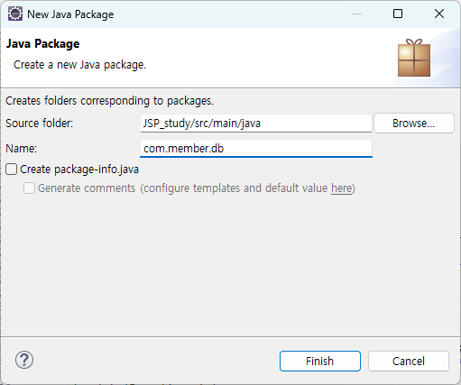
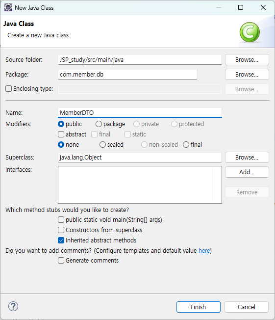
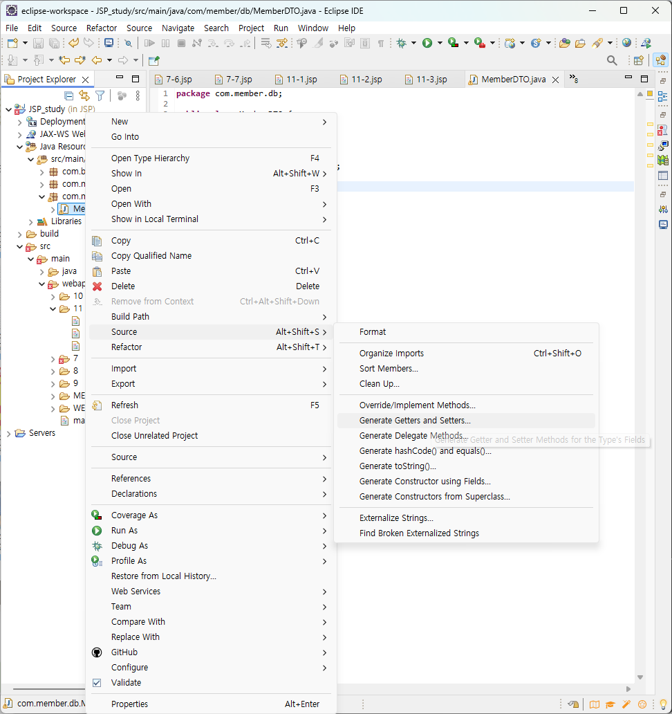

{:toc .large-only}

## 필요한 파일 설치하기

### MariaDB 설치

- https://mariadb.org/download/에 접속하여 MariaDB Server 인스톨러 다운로드
- 인스톨러 설치 및 root 계정 암호 설정
- `MySQL Clinet (MariaDB @버전)` 프로그램이 정상적으로 실행되는지 확인


### 자바 커넥터 설치

- https://mariadb.com/downloads/connectors/connectors-data-access/java8-connector 에서 java connector 설치
- `톰캣 설치 경로\lib` 혹은 `이클립스 프로젝트 경로\src\main\webapp\WEB-INF\lib` 에 복사

## DBMS 연동

### java.sql 패키지 import

- SQL 구문을 사용하기 위해 `java.sql` 패키지의 클래스를 이용해야 한다.

```jsp
<%@ page contentType="text/html; charset=UTF-8" %>
<%@ page import ="java.sql.*" %>
```

### 자바 커넥터 로드

- MariaDB에서 제공하는 자바 커넥터의 이름은 `org.mariadb.jdbc.Driver`이다.
- 자바에서 제공하는 `Class` 클래스의 `forname()` 메서드는 인자로 전달된 이름의 클래스를 로드하는 메서드이다.

```java
Class.forname("org.mariadb.jdbc.Driver");
```

### MariaDB 서버 접속

- MariaDB 서버에 접속하기 위해서는 접속 방법과 서버 주소, 아이디, 비밀번호가 필요하다.
- `jdbc:mariadb`는 JDBC를 이용하여 MariaDB 서버에 접속함을 의미한다.

```java
String url = "jdbc:mariadb://localhost:3306/my_db";
String user = "root";
String pw = "0000";
try (Connection con = DriverManager.getConnection(url, user, pw)) {
    ...
} catch (Exception e) {
    ...
}
```

### Statement 객체

- SQL 쿼리문을 사용하기 위해 Statement 객체를 생성한다.
- Statement 객체는 `Connection`의 `createStatement()` 메서드를 호출하여 생성한다.

```java
Statement stmt = con.createStatement();
```

- `stmt.executeQuery(String sql)`
  - select 구문을 실행할 때 사용
  - 실행 결과를 나타내는 테이블(ResultSet 객체)를 리턴함
- `stmt.executeUpdate(String sql)`
  - update, insert, delete 구문을 실행할 때 사용
  - 구문 실행으로 영향을 받은 레코드 개수(int형)를 리턴함

```java
ResultSet rs = stmt.executeQuery("select * from member");
```

### 예제 코드

#### select 구문으로 member 조회하기

```jsp
<%@ page import="java.sql.*" %>
...
<%
    Class.forName("org.mariadb.jdbc.Driver");
    String url = "jdbc:mariadb://localhost:3306/my_db";
    String user = "root";
    String pw = "0000";
    try (
        Connection con = DriverManager.getConnection(url, user, pw);
        Statement stmt = con.createStatement();
        ResultSet rs = stmt.executeQuery("select * from member");
    ) {
        while(rs.next()) {
            out.println("<tr><td>" + rs.getInt("id") + "</td>");
            out.println("<td>" + rs.getString("pass") + "</td>");
            out.println("<td>" + rs.getString("name") + "</td>");
            out.println("<td>" + rs.getString("phone") + "</td>");
            out.println("<td>" + rs.getString("address") + "</td></tr>");
        }
    } catch (Exception e) {
        out.println("MariaDB 연결 실패");
        e.printStackTrace();
    }
%>
```

- select 구문을 실행하여 ResultSet 객체가 생성되면 커서(행을 가리키는 포인터)가 만들어진다.
- `rs.next()`를 호출하면 커서가 첫 행을 가리키고, 그 다음 호출하면 다음 행의 레코드를 가리킨다.
- `rs.getInt(필드이름)`, `rs.getString(필드이름)`을 호출하면 해당 필드 값을 리턴한다.


#### insert 구문으로 member 추가하기

```jsp
<%@ page import="java.sql.*" %>
...
<%
    request.setCharacterEncoding("UTF-8");
    String id = request.getParameter("id");
    String pass = request.getParameter("pass");
    String name = request.getParameter("name");
    String phone = request.getParameter("phone");
    String address = request.getParameter("address");

    String url = "jdbc:mariadb://localhost:3306/my_db";
    String user = "root";
    String pw = "0000";
    try (
        Connection con = DriverManager.getConnection(url, user, pw);
        Statement stmt = con.createStatement();
    ) {
        String sql = String.format("insert into member values (%s, '%s', '%s', '%s', '%s')", id, pass, name, phone, address);
        int res = stmt.executeUpdate(sql);
        if(res == 1) {
            out.print("레코드 insert 성공");
        } else {
            out.print("레코드 insert 실패");
        }
    } catch (Exception e) {
        out.println("MariaDB 연결 실패");
        e.printStackTrace();
    }
%>
```

## DAO 클래스와 DTO 클래스

- 위 예제들에서 MariaDB에 연결하기 위한 코드의 중복, SQL 구문과 데이터베이스 정보가 노출되는 문제를 해결하기 위해 DAO 클래스와 DTO 클래스를 사용
- **DAO(Data Access Object)**
  - 데이터베이스에 연결하고 SQL 구문을 실행하는 클래스
- **DTO(Data Transfer Object)**
  - 주고받을 데이터를 저장하는 클래스
  - 특정 테이블에서 한 개의 레코드를 표현
  - 필드에 대한 읽기와 쓰기 메서드만을 제공
  - DAO 메서드에서 인자나 리턴 값으로 사용됨

### DTO 클래스 만들기

1. 프로젝트를 오른쪽 클릭한 후 New\>Package 메뉴를 선택하여 패키지를 추가한다.<br/>
1. 1번에서 만든 com.member.db를 오른쪽 클릭한 후 New\>Class 메뉴를 선택하여 DTO 클래스를 추가한다.<br/>
1. 2번에서 만든 MemberDTO.java 파일에 아래와 같은 내용을 입력한다.

```java
package com.member.db;

public class MemberDTO {
	private int id = 0;
	private String pass = null;
	private String name = null;
	private String phone = null;
	private String address = null;
}
```

MemberDTO.java 파일을 오른쪽 클릭한 후 Source\>Generate Getters and Setters... 메뉴를 선택한 후 모든 멤버 변수를 선택한다.



Generate 버튼을 누르면 파일에 모든 멤버 변수에 대한 getter, setter 메서드가 생성된다.

```java
package com.member.db;

public class MemberDTO {
	private int id = 0;
	private String pass = null;
	private String name = null;
	private String phone = null;
	private String address = null;
	public int getId() {
		return id;
	}
	public void setId(int id) {
		this.id = id;
	}
	public String getPass() {
		return pass;
	}
	public void setPass(String pass) {
		this.pass = pass;
	}
	public String getName() {
		return name;
	}
	public void setName(String name) {
		this.name = name;
	}
	public String getPhone() {
		return phone;
	}
	public void setPhone(String phone) {
		this.phone = phone;
	}
	public String getAddress() {
		return address;
	}
	public void setAddress(String address) {
		this.address = address;
	}
}
```

### DAO 클래스 만들기

1. com.member.db를 오른쪽 클릭한 후 New\>Class 메뉴를 선택하여 DAO 클래스를 추가한다. (DTO 파일과 같은 경로여야 한다.)
1. 2번에서 만든 MemberDTO.java 파일에 아래와 같은 내용을 입력한다.
1. sql 클래스를 사용하기 위해 `import java.sql.*;` 구문을 추가한다.
1. 아래 메서드들을 추가한다.

#### getConnection()

- MariaDB에 연결하고 연결 정보를 리턴하는 메서드
- MemberDAO 클래스 내부에서만 사용하는 private 메서드
- `throws Exception`: 예외 처리. 예외 발생 시 호출한 곳으로 전파

```java
private Connection getConnection() throws Exception {
    Class.forName("org.mariadb.jdbc.Driver");
    String url = "jdbc:mariadb://localhost:3306/my_db";
    String user = "root";
    String pw = "0000";
    Connection con = DriverManager.getConnection(url, user, pw);
    return con;
}
```

#### selectAll()

- member 테이블의 모든 레코드를 리턴하는 메서드
- MemberDTO 객체당 하나씩 레코드 저장
- 리턴 유형은 `ArrayList<MemberDTO>`

```java
public ArrayList<MemberDTO> selectAll() {
    ArrayList<MemberDTO> memberList = new ArrayList<MemberDTO>();
    try(
        Connection con = getConnection();
        Statement stmt = con.createStatement();
        ResultSet rs = stmt.executeQuery("select * from member");
    ) {
        while(rs.next()) {
            MemberDTO member = new MemberDTO();
            member.setId(rs.getInt("id"));
            member.setPass(rs.getString("pass"));
            member.setName(rs.getString("name"));
            member.setPhone(rs.getString("phone"));
            member.setAddress(rs.getString("address"));
            memberList.add(member);
        }
    } catch (Exception e) {
        e.printStackTrace();
    }
    return memberList;
}
```

#### selectOne()

- member 테이블에서 1개의 레코드를 리턴하는 메서드
- 매개변수로 조회할 레코드의 id 값이 주어짐
- 리턴 유형은 `MemberDTO`

```java
public MemberDTO selectOne(int id) {
    MemberDTO member = new MemberDTO();
    try(
        Connection con = getConnection();
        Statement stmt = con.createStatement();
        ResultSet rs = stmt.executeQuery(String.format("select * from member where id=%s", id));
    ) {
        rs.next();
        member.setId(rs.getInt("id"));
        member.setPass(rs.getString("pass"));
        member.setName(rs.getString("name"));
        member.setPhone(rs.getString("phone"));
        member.setAddress(rs.getString("address"));
    } catch (Exception e) {
        e.printStackTrace();
    }
    return member;
}
```

#### insertOne()

- member 테이블에서 1개의 레코드를 삽입하는 메서드
- 매개변수로 삽입될 MemberDTO 객체가 주어짐

```java
public void insertOne(MemberDTO member) {
    try(
        Connection con = getConnection();
        Statement stmt = con.createStatement();
    ) {
        String sql =
            String.format("insert into member values(%s, '%s', '%s', '%s', '%s')",
            member.getId(),
            member.getPass(),
            member.getName(),
            member.getPhone(),
            member.getAddress());
        stmt.executeQuery(sql);
    } catch (Exception e) {
        e.printStackTrace();
    }
}
```

### 예제 코드

#### select 구문으로 member 조회하기

```jsp
<%@ page import="java.sql.*" %>
<%@ page import="java.util.*" %>
<%@ page import="com.member.db.*" %>
...
<%
    ArrayList<MemberDTO> memberList = new MemberDAO().selectAll();
    for(MemberDTO member: memberList) {
        out.println("<tr><td>" + member.getId() + "</td>");
        out.println("<td>" + member.getPass() + "</td>");
        out.println("<td>" + member.getName() + "</td>");
        out.println("<td>" + member.getPhone() + "</td>");
        out.println("<td>" + member.getAddress() + "</td></tr>");
    }
%>
```

#### insert 구문으로 member 추가하기

```jsp
<%@ page import="java.sql.*" %>
<%@ page import="java.util.*" %>
<%@ page import="com.member.db.*" %>
...
<%
	request.setCharacterEncoding("UTF-8");
	MemberDTO member = new MemberDTO();
	member.setId(Integer.parseInt(request.getParameter("id")));
	member.setPass(request.getParameter("pass"));
	member.setName(request.getParameter("name"));
	member.setPhone(request.getParameter("phone"));
	member.setAddress(request.getParameter("address"));
	new MemberDAO().insertOne(member);
%>
```
