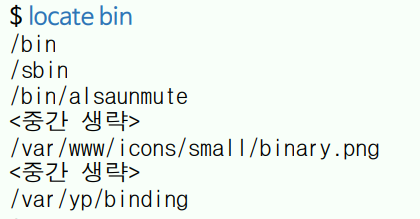

{:toc .large-only}

## vi 편집기

- 유닉스 계열 운영체제에서 가장 보편적인 화면 편집기
- vi는 'vim'으로 에일리어스 되어 있음
- vim
  - 형식이 다른 파일의 구문 구조를 표시하기 위해 컬러를 사용
  - 마우스 지원, 다중 undo, 다중 탭 또는 화면 분할 지원
  - 블록을 선택할 때 비주얼 모드를 지원

## vi 시작하기

- `vi [options] [filename]`
- vi 편집기는 모달 편집기로 실행하면 다른 작업은 수행할 수 없음
- 명령 모드, 입력 모드, 라인 모드의 세 가지 모드로 구분된다.

## vi 종료하기

- 명령 모드에서 종료하기: ZZ(`Shift` + zz)
  - 변경 내용을 저장하고 종료
- 라인 모드에서 종료하기: 아래 표 참고

| 명령           | 기능                                         |
| -------------- | -------------------------------------------- |
| :q             | 변경된 내용이 없는 경우 종료                 |
| :q!            | 저장하지 않고 강제 종료                      |
| :wq [filename] | 저장하고 종료                                |
| :x [filename]  | 변경이 있었다면 저장하고 종료                |
| :x! [filename] | 위와 같으나 같은 이름의 파일이 있으면 덮어씀 |

## vi 편집하기

### 커서 이동

- 명령 모드에서 `Page Up`, `Page Down`, `←`, `↓`, `↑`, `→` 등의 키로 커서 이동 가능

| 명령키             | 기능                             |
| ------------------ | -------------------------------- |
| h, j, k, l         | `←`, `↓`, `↑`, `→`               |
| `Ctrl`+f, `Ctrl`+b | `Page Up`, `Page Down`           |
| w                  | 다음 단어의 첫 자로 이동         |
| b                  | 앞 단어의 첫 자로 이동           |
| 0                  | 현재 라인의 첫 칸으로 이동       |
| $                  | 현재 라인의 마지막 칸으로 이동   |
| G                  | 마지막 라인으로 이동             |
| 20G                | 20번째 라인으로 이동             |
| 5j                 | 현재 라인에서 5 라인 아래로 이동 |

### 텍스트 입력

- 명령 모드에서 아래 표의 명령키를 입력하면 입력 모드로 이동함
- 입력 모드일 때는 화면의 하단에 '-- 끼워 넣기 --'가 표시됨
- 입력 모드에서 esc 키를 누르면 명령 모드로 돌아감

| 명령키 | 기능                                                           |
| ------ | -------------------------------------------------------------- |
| a      | 현재 커서 위치의 오른쪽부터 텍스트를 추가(add) 할 수 있음      |
| A      | 현재 라인의 끝에 텍스트를 추가할 수 있음                       |
| i      | 현재 커서의 위치부터 텍스트를 삽입(insert) 할 수 있음          |
| I      | 현재 라인의 처음에 텍스트를 삽입할 수 있음                     |
| o      | 현재 라인의 아래에 라인이 열리고(open) 텍스트를 추가할 수 있음 |
| O      | 현재 라인의 위에 라인이 열리고 텍스트를 추가할 수 있음         |

### 텍스트 삭제

- 명령 모드에서 텍스트를 삭제하거나 변경하는 명령

| 명령키    | 기능                                      |
| --------- | ----------------------------------------- |
| x         | 커서 위치의 한 문자를 삭제                |
| dx        | 커서의 위치부터 다음 단어 전까지 삭제     |
| d$ 또는 D | 커서의 위치부터 현재 라인의 끝까지 삭제   |
| d0        | 커서의 왼쪽부터 현재 라인의 처음까지 삭제 |
| dd        | 현재 라인을 삭제                          |
| dG        | 현재 라인부터 파일의 끝까지 삭제          |
| d20G      | 현재 라인부터 20 라인까지 삭제            |

### 텍스트 변경 또는 치환

- 변경 후 커서를 이동하고 도트(.) 명령을 수행하면 앞서 수행한 명령을 반복할 수 있음

| 명령키    | 기능                                                                            |
| --------- | ------------------------------------------------------------------------------- |
| r         | 텍스트를 입력하면 커서 위치의 한 문자를 대치                                    |
| R         | 입력 모드로 전환되고 텍스트를 입력하면 커서의 위치부터 계속 대치                |
| s 또는 cl | 입력 모드로 전환되고 커서 위치의 문자가 삭제됨. 텍스트를 입력하면 삽입됨(대치X) |
| S 또는 cc | 현재 라인에 존재하는 문자가 삭제되고 현재 라인에서 입력 모드로 전환됨           |
| cw        | 입력 모드로 전환되고 커서 위치부터 단어의 끝까지 삭제됨                         |
| cb        | 입력 모드로 전환되고 커서 왼쪽부터 단어의 앞까지 삭제됨                         |

### 텍스트 복사와 붙여넣기

| 명령키 | 기능                                                                             |
| ------ | -------------------------------------------------------------------------------- |
| yy     | 현재 라인을 복사                                                                 |
| 5yy    | 현재 라인부터 5 라인을 복사                                                      |
| yw     | 커서의 위치부터 다음 단어의 앞까지 복사                                          |
| y$     | 커서의 왼쪽부터 라인의 끝까지 복사                                               |
| y0     | 커서 왼쪽부터 라인의 앞까지 복사                                                 |
| yG     | 현재 라인부터 파일의 끝까지 복사                                                 |
| y)     | 커서의 위치부터 한 문장을 복사                                                   |
| y}     | 커서의 위치부터 한 문단을 복사                                                   |
| p      | 커서의 왼쪽에 붙여넣기. 복사된 텍스트가 라인이면 현재 라인의 위에 붙여넣기됨     |
| P      | 커서의 오른쪽에 붙여넣기. 복사된 텍스트가 라인이면 현재 라인의 아래에 붙여넣기됨 |

### 블록 지정하기

- 명령 모드에서 아래 표의 명령키를 입력하면 비주얼 모드로 이동함
- 블록을 지정하고 삭제(x) 또는 복사(y), 붙여넣기(p) 가능

| 명령키 | 기능           |
| ------ | -------------- |
| v      | 한 문자씩 선택 |
| V      | 한 라인씩 선택 |

### 명령어 취소 및 기타 명령

| 명령키    | 기능                                                                              |
| --------- | --------------------------------------------------------------------------------- |
| u         | 이전 작업 취소(undo)                                                              |
| `Ctrl`+r  | 앞서 취소했던 작업을 다시 한다. 즉, 취소를 취소한다.                              |
| :e!       | 마지막으로 저장한 후의 작업을 취소                                                |
| :n        | n번째 라인으로 이동                                                               |
| :!command | vi를 사용하다 쉘 명령 command를 수행                                              |
| :sh       | vi를 잠시 빠져나가 쉘 명령을 수행함. 쉘 명령으로 exit를 실행하면 다시 vi로 돌아옴 |

## 파일 찾기

### locate 명령

- 절대경로 상에서 문자열 패턴이 포함된 디렉터리와 파일 이름 출력
- `locate [options] pattern`
- updatedb 명령에서 만들어진 데이터베이스에서 검색함

### find 명령

- 지정된 위치에서 조건에 맞는 파일을 찾고, 검색된 파일을 대상으로 명령을 수행할 수 있음
- `find [pathnames] [expression]`
  - pathname(경로)를 지정하지 않으면 현재 디렉터리(.)를 기준으로 함
  - expression(조건)이나 액션을 지정하지 않으면 -print가 주어진다.

#### 조건

| 조건           | 설명                                                                                                                   |
| -------------- | ---------------------------------------------------------------------------------------------------------------------- |
| -cmin n        | 파일 또는 디렉터리의 마지막 수정시간이 정확히 n분인 경우                                                               |
| -cnewer file   | 파일 또는 디렉터리의 마지막 수정시간이 지정된 file보다 최근인 경우                                                     |
| -empty         | 파일 또는 디렉터리가 비어있는 경우                                                                                     |
| -name pattern  | 파일 또는 디렉터리의 이름이 pattern과 매칭되는 경우                                                                    |
| -iname pattern | -name과 같으나 대소문자를 구분하지 않음                                                                                |
| -nouser        | 파일 또는 디렉터리의 소유자가 유효하지 않은 경우                                                                       |
| -perm mode     | 파일 또는 디렉터리의 접근 권한이 mode와 같은 경우. mode는 8진수나 기호로 표기함                                        |
| -size n        | 파일 또는 디렉터리의 크기가 n인 경우                                                                                   |
| -type c        | 파일의 타입이 c인 경우. 타입은 b(블록 디바이스), c(문자 디바이스), d(디렉터리), f(정규 파일), I(심볼릭 링크) 등이 있음 |
| -user name     | 파일 또는 디렉터리의 소유자가 name인 경우                                                                              |

#### 액션

| 액션              | 설명                                                                                         |
| ----------------- | -------------------------------------------------------------------------------------------- |
| -delete           | 파일을 삭제                                                                                  |
| -ls               | 파일 또는 디렉터리의 정보를 자세히 보여줌                                                    |
| -print            | 경로를 포함하여 파일 이름을 출력함                                                           |
| -quit             | 매칭되는 것이 있다면 종료                                                                    |
| -exec command {}; | 사용자 정의 액션으로 임의의 command를 수행함. -exec 대신 -ok를 사용하면 확인 과정을 거침 |

#### 예시

- `find /usr/share -size +10M`: 지정 위치에서 10M보다 큰 크기의 파일 또는 디렉터리를 찾아 출력한다.
- `find /data -size +500M -size -5G -exec du '{}' \;`: 지정 위치에서 500M보다 크고 5G보다 작은 크기의 파일을 찾고, 검색된 파일 각각에 du 명령을 실행
- `find /home -user chris -ls`: 지정 위치에서 소유자가 chris인 파일 또는 디렉터리를 찾아 파일의 정보를 자세히 보여준다.
- `find /bin -perm 755 -ls`: 접근권한이 rwxr-xr-x인 파일 또는 디렉터리를 찾아 자세히 보여준다.

### grep 명령

- 파일에서 지정된 문자열 패턴을 포함한 라인을 찾아 출력
- 파이프(|)를 사용하여 앞 명령의 결과(검색된 파일)를 입력받아 검색할 때 자주 사용
- `grep [options] pattern [files]`
  - pattern은 찾으려는 문자열이며 정규식으로 표현 가능

#### 옵션

| 옵션 | 설명                                                                     |
| ---- | ------------------------------------------------------------------------ |
| -r   | 디렉터리를 지정한 경우 사용. 디렉터리에 포함된 모든 파일을 대상으로 검색 |
| -i   | 대소문자를 구분하지 않음                                                 |
| -v   | 매칭이 일어나지 않는 라인을 출력                                         |

#### 예시

- `grep root /etc/passwd`: /etc/passwd 파일에서 'root' 문자열을 포함하는 라인을 출력
- `grep -r updatedb /etc`: /etc 디렉터리에 있는 모든 파일에서 'updatedb' 문자열을 포함하는 라인을 출력
- `ip addr show | grep inet`: ip addr show 명령의 결과에서 'inet' 문자열을 포함하는 라인을 출력
