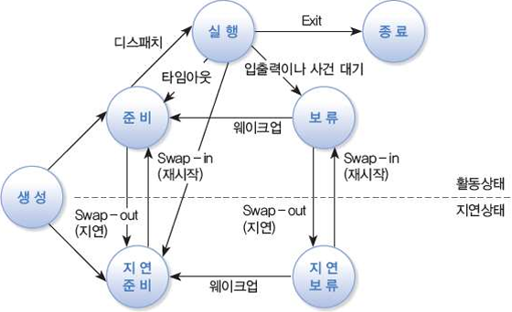
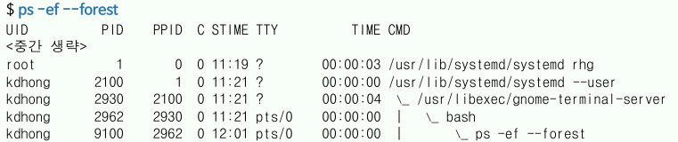

{:toc .large-only}

## 프로세스

- 커널에 등록되어 관리를 받는 실행 중인 프로그램
- 커널은 프로세스 관리 블록(PCB)에 프로세스에 관한 정보를 저장
- 프로세스는 시스템 자원을 사용하며 여러 상태 변화를 겪는다.
- 각 프로세스는 유일한 PID를 가짐
- systemd 프로세스는 PID가 1이며, 모든 사용자 프로세스의 조상 프로세스이다.
- 로그인을 하거나 터미널 창을 열면 bash 프로세스가 할당된다.
- 프로세스는 필요에 따라 자식 프로세스를 생성한다.
- 데몬 프로세스는 서비스 요청을 처리하기 위한 백그라운드 프로세스이다.

### 프로세스 관리 블록(PCB)

- 커널에 등록된 각 프로세스에 대한 정보를 저장하는 영역
- PCB에 저장되는 정보
  - PID와 PPID
  - UID와 EUID 및 GID와 EGID
  - 프로세스의 현재 상태: 실행, 준비, 보류 등의 상태 정보와 CPU 사용 시간 등
  - 프로세스 우선순위
  - 프로세스가 사용 중인 자원에 대한 정보: 메모리 주소, 입출력 장치, 파일 등
  - 모든 대기 중인 시그널의 목록
  - 문맥 교환 정보

### 프로세스의 생성

- 셸에서 명령을 실행하면 새로운 프로세스가 만들어져 수행됨
  - `fork()`를 호출하면 부모 프로세스가 자신의 복사본 자식 프로세스를 만듦
  - `exec(program)`를 호출하면 기존 프로세스를 새로운 프로세스로 대체함
- 프로그램이 종료되면 자식 프로세스가 종료됨
- 부모 프로세스는 보류 상태에 있다가 자식 프로세스가 종료되면 깨어남
- `pstree` 명령은 프로세스 트리(부모-자식 관계)를 보여주는 명령이다.

### 포어그라운드와 백그라운드 프로세스

#### 포어그라운드 프로세스

- 셸 프롬프트에서 명령을 실행하면 포어그라운드 모드로 수행된다.
- 포어그라운드 프로세스는 터미널에 대한 제어권을 가지며 키보드 입력 및 화면 출력이 가능하다.
  - 하나의 프로세스만 터미널로부터 키보드 입력을 받을 수 있다.
  - 포어그라운드 프로세스가 끝나기 전에는 다른 명령을 수행할 수 없다.
  - 포어그라운드로 실행 중인 프로세스를 강제 중지하려면 `Ctrl`+c
- 포어그라운드 실행 중에 `Ctrl`+z를 하면 백그라운드로 전환되며 멈춤(또는 지연) 상태가 된다.

#### 백그라운드 프로세스

- 백그라운드로 실행하려면 셸 프롬프트에서 명령의 끝에 &를 추가하여 실행
- 백그라운드로 프로세스를 실행시키면 터미널 출력은 가능하지만 키보드 입력은 받을 수 없다.
  - 키보드 입력이 필요하면 지연(멈춤) 상태가 된다.
  - 입력 없이 장시간 실행되어야 하는 경우 주로 사용한다.
- 터미널 창을 종료하면 연결된 모든 백그라운드 프로세스가 종료된다.
- 셸에서 `fg jobld`를 실행하면 백그라운드 프로세스가 포어그라운드로 전환된다.
- `jobs` 명령으로 백그라운드 프로세스의 상태를 확인할 수 있다.

### 특수권한

#### SetUID

- 실행 파일에 SetUID가 설정되어 있으면 해당 파일이 실행될 때 실행시킨 사용자가 아닌 **파일 소유자의 권한**으로 실행됨
  - 프로세스의 EUID는 파일의 소유자가 됨
- 파일의 접근권한에서 **소유자(u)**의 실행 권한에 x가 아닌 s가 표시됨
- 설정 방법은 `chmod 4755 file` 또는 `chmod u+s file`
- 해제 방법은 `chmod 0755 file` 또는 `chmod u-s file`

#### SetGID

- 파일의 접근권한에서 **그룹(g)**의 실행권한에 x가 아닌 s가 표시됨
- SetGID가 설정된 파일을 실행하면 실행시킨 사용자의 그룹 권한이 아닌 **파일 소유자의 그룹 권한**으로 실행됨
- SetGID가 설정된 디렉터리에 파일을 생성하면 파일의 소유 그룹이 디렉터리의 소유 그룹으로 지정된다.
- 설정 방법은 `chmod 2755 file` 또는 `chmod g+s file`

#### StickyBit

- 파일의 접근권한에서 **기타 사용자(o)**의 실행권한에 x가 아닌 t가 표시됨
- 주로 공유 디렉터리에 설정된다.
- StickyBit가 설정된 디렉터리에 누구나 파일을 생성할 수 있지만 삭제는 파일의 소유자만 할 수 있다.
- 설정 방법은 `chmod 1777 file` 또는 `chmod o+t file`

## 프로세스의 상태

1. 사용자가 작업을 요청하면 프로세스가 커널에 등록되고 생성상태가 된다.
1. 생성상태에서 하드디스크로부터 메모리로 프로세스가 로드되면 프로세스는 준비상태가 된다. 만약 충분한 메모리 공간이 없다면 지연준비상태로 들어간다.
1. 준비상태에서 CPU 스케줄러가 특정 프로세스에 CPU를 할당하면 해당 프로세스가 실행상태가 되는데, 이 과정을 디스패치라고 한다.
1. 실행상태에서 CPU는 프로세스가 가진 명령어를 실행한다. 실행상태에 있는 프로세스가 주어진 시간 동안 작업을 끝내지 못하거나(timeout) 우선순위가 높은 프로세스가 등장하면, 준비상태로 돌아가고 CPU 스케줄러에 의해 다른 프로세스가 CPU를 선점한다.
1. 실행상태의 프로세스가 사용자 입출력장치의 사용을 기다리면 보류(대기)상태로 들어간다.
1. 보류상태에서 입출력 처리 작업이 종료되면 준비상태로 들어가서 CPU가 할당되기를 기다리는데, 이 과정을 웨이크업(wakeup)이라고 한다.
1. 준비상태 또는 보류상태에서 가지고 있던 메모리를 내놓고 지연준비상태 또는 지연보류상태로 전이될 수 있다.
1. 실행상태의 프로세스가 실행을 마무리하면 프로세스는 종료상태가 되고, 가지고 있던 모든 자원을 반납한다.

### ps 명령

- `ps [options]`
- 프로세스의 현재 상태를 확인하는 명령
  - 옵션 없이 명령을 실행하면 현재 터미널과 연결되어 있는 프로세스 중 프로세스의 EUID가 현재 사용자의 UID와 같은 프로세스를 보여줌
  - `ps -ef`와 `ps aux` 명령은 모든 사용자의 모든 프로세스에 관한 많은 정보를 보여줌

|          옵션          | 설명                                                               |
| :--------------------: | ------------------------------------------------------------------ |
|           a            | 터미널과 연결된 모든 사용자의 모든 프로세스를 출력함               |
|       -A 또는 -e       | 모든 사용자의 모든 프로세스를 출력함                               |
|           u            | 현재 사용자의 프로세스를 사용자 친화적으로 자세히 출력함           |
|           x            | 현재 사용자가 소유한 모든 프로세스를 출력함.                       |
|        -p PIDs         | 주어진 PID를 가진 프로세스를 출력함                                |
|           e            | 프로세스 정보에 환경변수 정보를 포함시켜 출력함                    |
|   l 또는 -l 또는 -f    | 프로세스에 관한 많은(long of full) 정보를 출력함                   |
| o format -o format | 출력을 원하는 항목을 지정하여 출력함. ex) `ps -o pid,ppid,uid,cmd` |

## 프로세스 관리

### top 명령

- `top [options]`
- 현재 실행 중인 프로세스의 모니터링과 관리를 위한 대화식 도구
- 개별 프로세스의 실시간 상황을 주기적으로 보여줌
  - 프로세스의 상태, CPU와 메모리 사용량 및 시스템의 부하 등을 확인
- ps 명령의 동적 대화식 버전

|   옵션   | 설명                                                           |
| :------: | -------------------------------------------------------------- |
| -d delay | 갱신 시간의 주기를 초 단위로 지정                              |
| -p pids  | 지정된 PID를 가진 프로세스를 모니터함                          |
| -u user  | 지정된 사용자명 또는 EUID를 가진 프로세스를 모니터함           |
|  -n num  | 프로세스의 상태를 표시할 횟수. num회를 출력한 후 명령이 종료됨 |
|    -S    | 프로세스의 총 CPU 사용 시간(자식 프로세스 포함) 출력           |

### kill 명령

- 다른 프로세스에게 시그널을 보내는 명령
- 기본 시그널은 TERM
- `kill [-signal] pids` 또는 `kill [-s signal] pids`
  - signal은 시그널의 이름 또는 번호
  - `kill pids` 명령은 TERM 시그널을 보냄
- `killall [options] [-s signal] [-u user] names`
  - 특정 프로세스에 한꺼번에 시그널을 보내는 명령

| 시그널 | 설명                                                                                                                              |
| :----: | --------------------------------------------------------------------------------------------------------------------------------- |
|  HUP   | 터미널이 종료될 때 터미널에 연결된 모든 프로세스에게 보내짐. 또는 데몬 프로세스가 설정 파일을 다시 읽어 재시작하게 만들 때도 사용 |
|  INT   | Interrupt의 의미로 터미널에서 `Ctrl`+c를 누르는 것과 같다. 대게 프로세스를 종료시킨다.                                            |
|  KILL  | Kill의 의미로 프로세스를 강제로 즉시 종료시킴                                                                                     |
|  TERM  | terminate의 의미로 kill 명령의 기본 시그널. 정상적인 종료 방법으로 프로그램을 끝내게 한다.                                        |
|  CONT  | Continue의 의미로 STOP 시그널로 중단된 프로세스를 재개시킴                                                                        |
|  STOP  | Stop의 의미로 프로세스를 잠시 중단시킴                                                                                            |
|  TSTP  | Terminal Stop의 의미로 터미널에서 `Ctrl`+z를 누르는 것과 같다.                                                                    |

### nice와 renice 명령

- nice 우선순위 값(또는 NI 값)을 조정하는 명령
- NI 값은 -20(가장 높은 우선순위)부터 19(가장 낮은 우선순위)까지이며 기본값은 0이다.
- `nice [option] [command]`
  - 명령을 실행할 때 NI 값을 조정하는 명령
  - 일반 사용자는 자신이 소유한 프로세스의 우선순위를 낮추는 것만 가능함
  - 옵션 없이 실행하면 현재 설정된 NI 값(부모 프로세스의 NI 값)을 출력함
- `renice priority [options]`
  - 실행 중인 프로세스의 NU 값(절대값)을 바꾸는 명령
  - 일반 사용자는 자신이 소유한 프로세스의 우선순위를 낮추는 것만 가능함

### nohup 명령

- HUP 시그널과 무관하게 백그라운드 명령이 스스로 종료될 때까지 계속 수행시키는 명령
  - 로그아웃을 하거나 터미널 창을 끝내면 백그라운드 프로세스에도 HUP 시그널이 보내짐
- nohup 명령을 실행하는 경우 명령 행의 끝에 &를 붙여 백그라운드로 실행해야 함

## cron 서비스

- 지정된 시간에 주기적으로 자동 수행되는 계획된 작업을 수행함
- cron 작업의 리스트는 crontab 파일에 저장됨
- crond 데몬 프로그램이 서비스를 제공
  - 1분 간격으로 crontab 파일을 검사하여 정해진 시간에 작업을 수행함

### crontab 항목의 의미

- 분, 시, 날짜, 달, 요일 순서
- `*`는 매번을 의미
- `/`: 간격 표시
- `-`: 범위 표시
- ex) `0 */6 * * 1-5 /bin/mail -s "Hi" jjpark@localhost`
  - 6시간 간격으로(0시부터) 월요일부터 금요일까지 메일을 보냄

### crontab 명령

- `crontab [options]`
- 일반 사용자가 cron 작업을 자신의 crontab 파일에 등록하기 위해 사용하는 명령
  - 일반 사용자는 crontab 파일을 직접 수정할 수 있는 권한이 없으므로 crontab 명령을 사용한다.
- 지정된 시간에 일회성으로 작업을 예약하려면 `at` 명령을 사용함

|  옵션   | 설명                                             |
| :-----: | ------------------------------------------------ |
|   -l    | crontab 파일에 등록된 작업 리스트를 출력함       |
|   -e    | crontab 파일을 편집하여 작업을 등록하거나 수정함 |
|   -r    | crontab 파일을 삭제함                            |
| -u user | 지정된 사용자의 crontab 파일을 사용함            |
