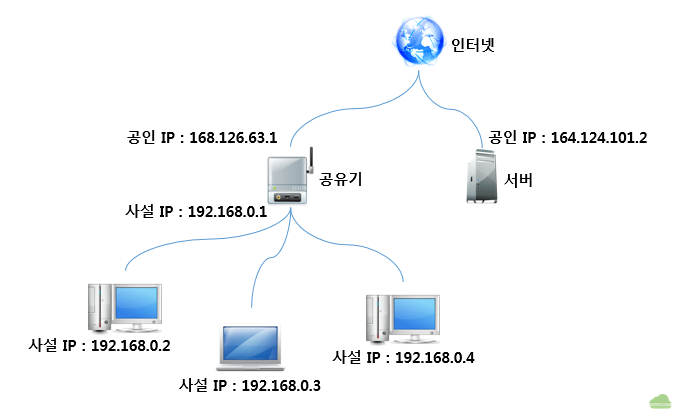
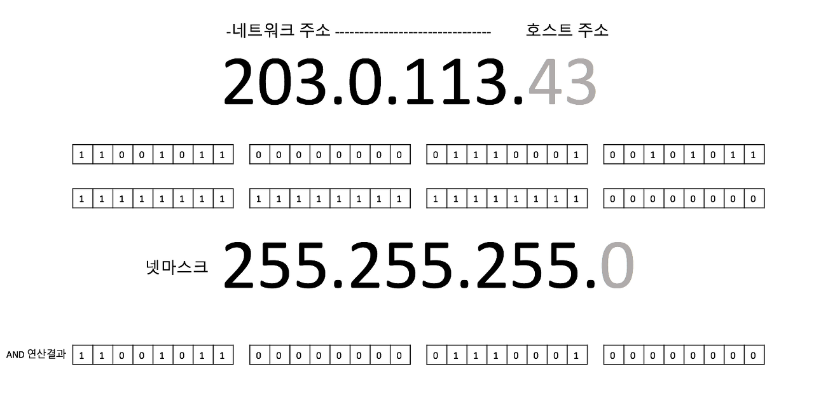
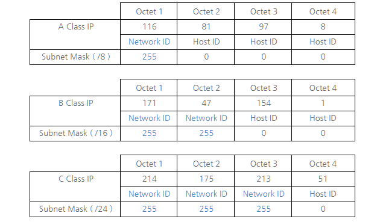

{:toc .large-only}

### IP 주소란?

- Internet Protocol address (표준어: 인터넷규약주소)
- 컴퓨터 네트워크에서 장치들이 서로를 인식하고 통신을 하기 위해서 사용하는 특수한 번호
- 이 번호를 이용하여 발신자를 대신하여 메시지가 전송되고 수신자를 향하여 예정된 목적지로 전달된다.
- 모든 장비에는 IP 주소가 부여되어야만 한다.

### IPv4 주소 체계

- IP 주소를 부여하는 방식으로, 현재 쓰이는 것이 IPv4(IP version 4) 규약이다.
- 32비트로 구성된 주소체계로 0~255 사이의 십진수 넷을 점으로 구분하여 부여 (ex. 168.126.63.1)

### Public IP

- ISP(인터넷 서비스 공급자)가 제공하는 IP 주소
- 외부에 공개되어 있는 IP 주소
- 인터넷에 연결된 다른 PC로부터의 접근이 가능

### Private IP

- 라우터에 연결된 개인 PC는 사설(Private) IP를 각각 할당 받아 인터넷에 접속할 수 있다.
- 아래 3개의 클래스 대역은 사용자가 자신의 컴퓨터에 임의로 부여해도 되는 IP 주소 대역이 된다.
  - A 클래스 : 10.0.0.0 ~ 10.255.255.255
  - B 클래스 : 172.16.0.0 ~ 172.31.255.255
  - C 클래스 : 192.168.0.0 ~ 192.168.255.255
- 사설 IP로 사용되는 대역은 사용자가 임의로 부여하고 사용할 수 있지만 인터넷 상에서 서로 연결되지 않는다.
- 사설 IP를 부여한 컴퓨터는 공인 IP에서 알아볼 수가 없다.
- **사설 IP로 서버를 돌리면 같은 공유기를 사용하는 사설 IP를 가진 PC에서만 접속할 수 있다.**
- **외부에서 공인 IP를 통해 사설 IP에 접근하려면 포트포워딩을 해야 한다.**

 

 

- 위의 그림을 보면 공유기의 내부 주소인 192.168.0.1와 공유기에 연결된 192.168.0.2 ~ 192.168.0.4는 사설 IP이고 공유기가 인터넷에 연결된 168.126.63.1은 공인 IP가 된다.
- 인터넷 상에서 164.124.101.2라는 주소를 치면 서버에 접속할 수 있지만 192.168.0.x 대역에 있는 피시와 노트북에는 접속할 수 없다.

| 구분      | 공인 IP (Public IP)          | 사설 IP (Private IP)        |
| --------- | ---------------------------- | --------------------------- |
| 할당 주체 | ISP(인터넷 서비스 공급자)    | 라우터(공유기)              |
| 할당 대상 | 개인 또는 회사의 서버/라우터 | 개인 또는 회사의 기기       |
| 고유성    | 인터넷 상에서 유일한 주소    | 하나의 네트워크 안에서 유일 |
| 공개 여부 | 내/외부 접근 가능            | 외부 접근 불가능            |

### 고정 IP

- 고정적으로 부여된 IP로 한번 부여되면 IP를 반납하기 전까지는 다른 장비에 부여할 수 없다.
- 인터넷 상에서 서버를 운영하고자 할 때는 공인 IP를 고정 IP로 부여해야 한다.
- 공인 IP를 부여받지 못하면 다른 사람이 내 서버에 접속할 수가 없고, 고정 IP를 부여하지 않으면 내 서버가 아닌 다른 사람의 서버로 접속이 될 수도 있기 때문이다.

### 유동 IP

- 장비에 고정적으로 IP를 부여하지 않고 컴퓨터를 사용할 때 남아 있는 IP 중에서 돌아가면서 부여하는 IP
- 집에서 사용하는 인터넷 서비스 업체는 각 가정마다 공인 IP를 유동 IP로 부여하고, 공유기 내부에서는 사설 IP를 유동 IP로 부여하는 것이 일반적이다.

## 넷마스크

IP 주소는 네트워크 주소와 호스트(컴퓨터 또는 프린터나 라우터와 같은 기타 장치) 주소를 합쳐서 32비트로 결정하기 때문에 어느 부분이 네트워크 주소인지 또는 호스트 주소인지 알 수 없다.

그러므로 넷마스크를 톻해 네트워크 주소를 구분한다.

넷마스크는 네트워크 주소와 호스트 주소의 경계인 점(.)을 기준으로 네트워크 주소 부분의 비트를 1로 치환하여 표현한다.

IP 주소와 넷마스크로 AND연산을 하면 아래처럼 네트워크 주소를 얻을수 있다.

IP의 클래스에 따라 넷마스크 달라진다.

## 참고사이트

[공인(Public) && 사설(Private) IP의 차이점](https://velog.io/@hidaehyunlee/%EA%B3%B5%EC%9D%B8Public-%EC%82%AC%EC%84%A4Private-IP%EC%9D%98-%EC%B0%A8%EC%9D%B4%EC%A0%90) 
[공인 IP, 사설 IP, 고정 IP, 유동 IP](http://gotocloud.co.kr/?p=320) 
[서브넷 마스크란 무엇인가요?](https://nordvpn.com/ko/blog/what-is-subnet-mask/) 
[넷마스크(Netmask)와 서브넷마스크(Subnetmask)](https://velog.io/@hidaehyunlee/%EB%84%B7%EB%A7%88%EC%8A%A4%ED%81%ACNetmask%EC%99%80-%EC%84%9C%EB%B8%8C%EB%84%B7%EB%A7%88%EC%8A%A4%ED%81%ACSubnetmask)
