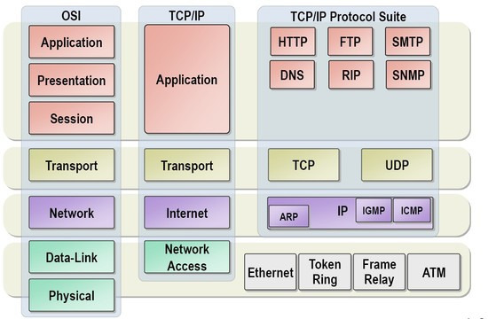

{:toc .large-only}

### 프로토콜

- 네트워크 통신 규약
- 다양한 규격끼리 데이터를 주고받을 때 같은 프로토콜을 사용하여 주고받는 방식을 따르도록 함
- 상황에 따라 전달할 데이터가 다르기 때문에 맞는 프로토콜을 사용한다.
- Syntax, Semantic, Timing 세 가지 요소로 구성됨
  - **Syntax**
    - 문법, 구문, 데이터 포맷(형식)
    - 데이터 포멧 : 통신, 처리, 해석하는데 적합하도록 형식화된 표현
  - **Semantic**
    - 특정 패턴을 어떻게 해석하고, 어떤 동작을 할 것인가 결정
    - 오류 방지 제어 정보
  - **Timing**
    - 전송 속도, 처리 순서 제어

### 프로토콜의 기능

- **단편화** : 패킷을 나눠서 전송한다.
- **재조립** : 데이터를 받는 쪽에서 패킷을 다시 재조립한다.
- **에러 제어** : 정상 수신되지 않았거나 데이터가 변형되었다면 다시 전송할 수 있다.
- **순서 제어** : 패킷에 숫자를 붙여 순서를 제어한다.
- **동기화** : 동기화를 통해 데이터를 주고 받는 양쪽을 같은 상태로 만든다.
- **캡슐화** : 전송 계층을 거치면서 특정 제어정보(주로 header)를 추가하는 것
- **흐름 제어** : 송신측과 수신측의 데이터 흐름의 양, 속도 제어
- **혼잡 제어** : 송신측과 수신측 그리고 네트워크의 데이터 흐름의 양, 속도 제어
  - [TCP의 흐름제어, 혼잡제어](https://jwprogramming.tistory.com/36)

### OSI 7계층과 TCP/IP 계층

#### TCP/IP 계층별 프로토콜 종류

- 응용 계층 (Application Layer)
  - HTTP (Hypertext Transfer Protocol)
  - FTP (File Transfer Protocol): 파일 전송을 위한 프로토콜
- 전송 계층 (Transport Layer)
  - TCP (Transmission Control Protocol)
  - UDP (User Datagram Protocol)
- 인터넷 계층 (Internet Layer)
  - IP
- 링크 계층 (Link Layer)
  - 이더넷

### TCP

- 연결형 서비스로 가상 회선 방식을 제공한다.
- 신뢰성을 보장한다.
- 흐름 제어 및 혼잡 제어
- 서버와 클라이언트는 1대1로 연결된다.
- 패킷에 대한 응답을 해야하기 때문에(시간 지연, CPU 소모) 성능이 낮다.
- 이메일, 파일 전송같은 곳에 사용

 

### UDP

- 비연결형
- 신뢰성을 보장하지 않는다.
- 전송 속도가 빠르다.
- 중간에 끊김이 있다.
- 흐름제어(flow control)가 없어서 패킷이 제대로 전송되었는지, 오류가 없는지 확인할 수 없다.
- 소켓 대신 IP를 기반으로 데이터를 전송한다.
- 실시간 전화나 라이브 방송같은 곳에 사용

 

### TCP와 UDP의 차이

- TCP는 UDP보다 전송 속도가 느리다.
- TCP가 등기우편이라면 UDP는 일반우편으로 비유할 수 있다.

 

### 서로 다른 프로토콜을 사용하면 어떻게 될까?

- TCP, UDP 각각 클라이언트가 전송한 데이터를 그대로 보내주는 echo 서버를 만들어 와이어샤크로 테스트
- TCP echo 서버를 실행한다.
  1. TCP 패킷을 날리면 정상 작동한다.
  1. UDP 패킷을 날리면 반응하지 않는다.
  1. TCP 포트로 열려있기 때문에 UDP 패킷이 통과하지 못한다.
- UDP echo 서버를 실행한다.
  1. UDP 패킷을 날리면 정상 작동한다.
  1. TCP 패킷을 날리면 에러가 난다.
  1. UDP 포트로 열려있기 때문에 TCP 패킷이 통과하지 못한다.
- **다른 프로토콜을 사용하면 통신되지 않는다.**

 

[[TCP/UDP] TCP와 UDP의 특징과 차이](https://mangkyu.tistory.com/15) 
[Protocol, 프로토콜, 통신 규약](http://www.ktword.co.kr/test/view/view.php?m_temp1=432)
