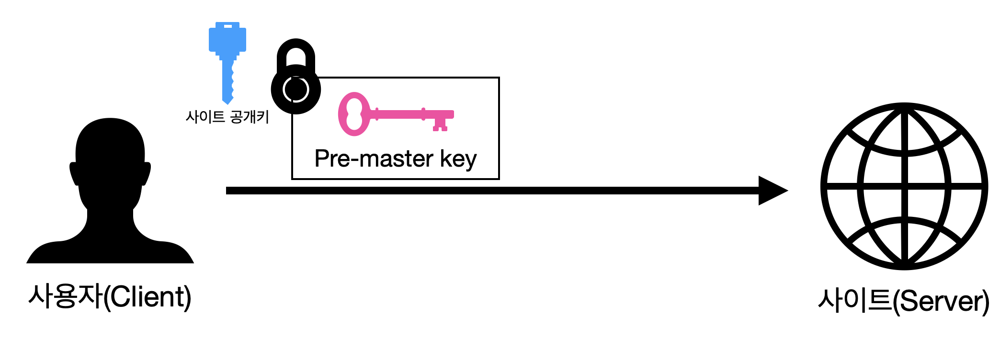
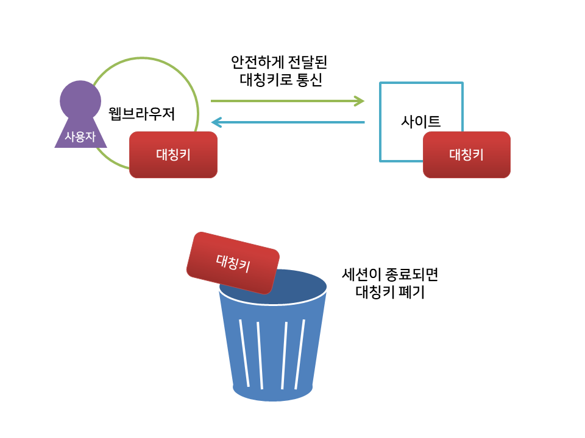

{:toc .large-only}

## HTTP와 HTTPS의 차이

- HTTP: **Hypertext Tranfer Protocol**

- HTTPS: **Hypertext Tranfer Protocol Over Secure Socket Layer**

 

 

- HTTP는 암호화되지 않은 방법으로 데이터를 전송하기 때문에 보안성이 낮다.

- `getUserMedia()`를 통한 사진 촬영이나 오디오 녹음과 같은 기능들을 실행하려면 HTTPS 프로토콜을 사용해야 한다.

- HTTPS는 SSL이나 TLS 프로토콜을 통해 요청과 응답 데이터를 암호화한다.

- 웹이 인터넷 위에서 동작하는 서비스 중의 하나인 것처럼 HTTPS도 SSL 프로토콜 위에서 동작하는 프로토콜이다.

- 암호화된 HTTPS 메시지를 교환하기 전에 클라이언트와 서버는 SSL 핸드쉐이크를 진행한다.

 

 

## SSL과 TLS

- 네스케이프에 의해서 SSL이 발명되었고, 이것이 점차 폭넓게 사용되다가 표준화 기구인 IETF의 관리로 변경되면서 TLS라는 이름으로 바뀌었다.

- SSL은 취약점이 있어 TLS를 사용하도록 권고된다.

- TLS는 SSL의 새 버전으로 도입된 것이지만 아직 TLS를 SSL이라고 부르는 사람도 많다.

## SSL 디지털 인증서

- 클라이언트와 서버간의 통신을 공인된 제3자(CA) 업체가 보증해주는 전자화된 문서

- 클라이언트가 서버에 접속하면 서버는 인증서 정보를 전달하고 클라이언트는 인증서 정보가 신뢰할 수 있는 것인지를 검증

## 공개키 방식

- A키로 암호화를 하면 B키로 복호화 할 수 있고, B키로 암호화하면 A키로 복호화 할 수 있는 방식

- 둘 중 하나를 비공개키(Private Key) 혹은 개인키라 부르며, 이는 자신만 가지고 있고 공개되지 않는다.

- 나머지 하나를 공개키(Public Key)라고 부르며 타인에게 제공한다.

- 공개키가 유출이 되어도 비공개키를 모르면 복호화 할 수 없기 때문에 안전하다.

## 대칭키 방식

- 동일한 키로 암호화와 복호화를 같이 할 수 있는 암호화 방식

- 공개키보다 빠르게 통신할 수 있다.

## SSL 인증서 발급과정

[1] 사이트는 정보와 공개키를 인증기관으로 전송한다.

[2] 인증기관은 검증을 거친 후, 사이트 정보과 공개키를 인증기관의 개인키로 암호화하여 인증서를 제작한다.

[3] 인증기관은 제작한 인증서를 사이트에게 전달한다.

[4] 인증기관은 웹 브라우저에게 공개키를 제공하며 이 정보는 브라우저에 내장된다.

> 브라우저는 어떻게 CA의 공개키를 아는가? 웹 브라우저를 설치할 때 주요 인증 기관의 공개 키와 함께 설치되며 신뢰하는 CA 인증서 집합이 구성되어 있다.

## SSL 인증서 동작과정

[1] 사용자가 사이트에 접속한다. 이 단계를 Client Hello라고 한다. 이 때 아래 정보들을 서버로 보낸다.

- 랜덤 데이터
- 클라이언트가 지원하는 암호화 방식들
- 세션 아이디

[2] 서버는 응답으로 Server Hello를 하게 된다. 아래 정보들을 클라이언트로 보낸다.

- 서버 측에서 생성한 랜덤 데이터
- 서버가 선택한 클라이언트의 암호화 방식
  - 클라이언트가 전달한 암호화 방식 중에 선택. 이로써 암호화 방식에 대한 협상이 종료되고 서버와 클라이언트는 이 암호화 방식을 이용해서 정보를 교환
- 인증서
  - CA의 비밀키로 암호화된 상태이며, CA의 공개키는 누구에게나 공개되어 있다.

[3] 클라이언트는 브라우저에 내장된 CA 리스트에 서버가 보낸 인증서가 있는지 확인하고, CA의 공개키를 이용해 인증서를 복호화한다. 복호화에 성공하면 서버의 공개키를 얻게 된다.

클라이언트는 1번에서 클라이언트가 생성한 랜덤 데이터와 2번에서 받은 서버의 랜덤 데이터를 조합해서 pre master secret라는 키를 생성한다.

이 때 사용할 암호화 기법은 **대칭키**이기 때문에 pre master secret 값은 제 3자에게 절대로 노출되어서는 안 된다. 이 키는 3번에서 인증서 복호화를 통해 얻어낸 서버의 공개키로 암호화하여 서버로 전송한다.

[4] 서버는 클라이언트가 전송한 pre master secret 값을 자신의 비공개키로 복호화한다. 이로서 서버와 클라이언트가 모두 pre master secret 값을 공유하게 되었다.

[5] 클라이언트와 서버는 Handshake 종료를 서로에게 알린다.

이제 클라이언트와 서버는 대칭키를 이용하여 암호문을 주고 받으며 세션이 종료되면 대칭키를 폐기한다.

#### 전체 과정

## 참고사이트

[HTTPS란? (동작방식, 장단점)](https://rachel-kwak.github.io/2021/03/08/HTTPS.html) 
[HTTPS와 SSL 인증서](https://opentutorials.org/course/228/4894) 
[HTTPS와 SSL 인증서, SSL 동작방법](https://wayhome25.github.io/cs/2018/03/11/ssl-https/) 
[SSL / TLS](https://has3ong.github.io/computer%20science/ssl-tls/) 
[HTTPS와 SSL/TLS](https://velog.io/@bambookim/HTTPS%EC%99%80-SSLTLS)
