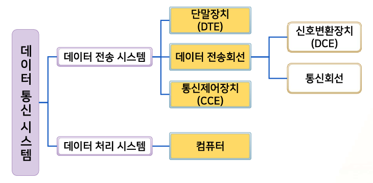
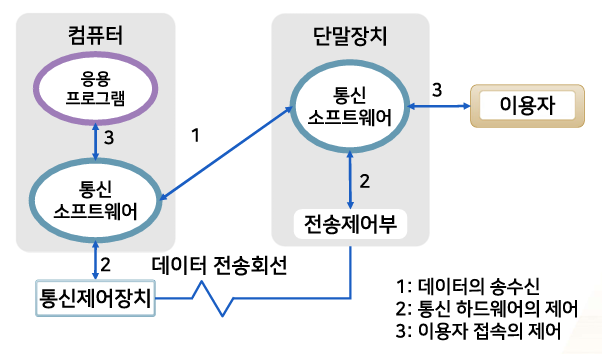
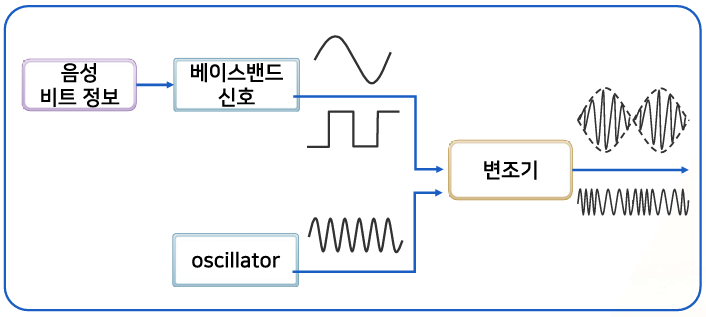
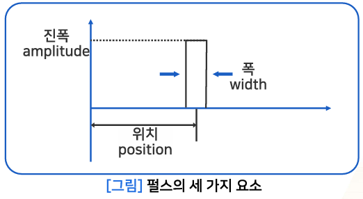
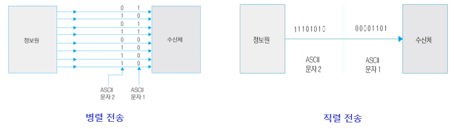
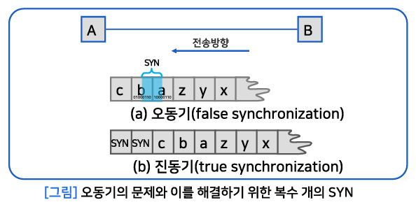
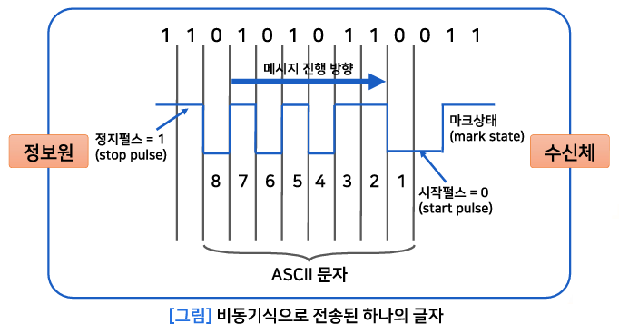
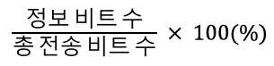
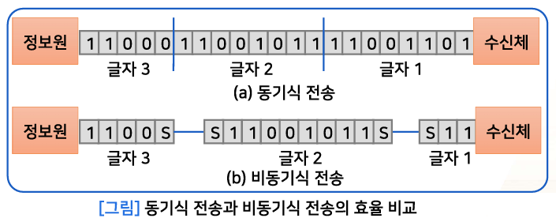

{:toc .large-only}

## 통신

- 한 점으로부터 다른 점으로 어떤 정보(데이터 또는 메시지)의 전달

### 통신의 3대 요소

- 정보원
- 전송매체
- 수신체

## 분산 시스템

- 컴퓨터 자원을 공유하고 분산시켜 작업을 처리하는 시스템
- 강연결 분산시스템과 약연결 분산시스템이 있다.

#### 거리에 따른 분산 시스템의 분류

| 구분               | 분산 시스템의 예                | 처리기 거리 | 처리기 범위             |
| ------------------ | ------------------------------- | ----------- | ----------------------- |
| 강연결 분산 시스템 | 데이터 흐름 기계 , 멀티프로세서 | 짧음        | 회로기판, 컴퓨터 시스템 |
| 약연결 분산 시스템 | Local Area Network(LAN)         | 소규모      | 방, 건물, 마을          |
|                    | Metropolitan Area Network(MAN)  | 중규모      | 나라                    |
|                    | Wide Area Network(WAN)          | 대규모      | 대륙                    |

## 데이터 통신망

- 컴퓨터 시스템에 의한 데이터 전송 기술과 망 기술이 융합된 개념
- 컴퓨터 통신망, 정보통신망이라고도 부름
- **약연결 분산시스템**

### 데이터 통신망의 구성요소

| 구성요소      | 설명                                                                                                    |
| ------------- | ------------------------------------------------------------------------------------------------------- |
| 서버          | 데이터 통신망에서 특정 서비스를 제공해주는 컴퓨터                                                       |
| 클라이언트    | 서비스를 받고자 하는 컴퓨터 또는 단말                                                                   |
| 전송 매체     | 데이터 통신망에서 서버 및 클라이언트를 상호 연결시키고 데이터 전송이 가능하도록 하기 위해 사용하는 장비 |
| 네트워킹 장치 | 서버와 클라이언트를 데이터 통신망에 연결시키기 위해 필요한 연결 장치                                    |
| 프로토콜      | 서버와 클라이언트가 통신하기 위해 미리 정해 놓은 규칙                                                   |
| 애플리케이션  | 데이터 통신망을 통해 서버가 클라이언트에게 제공하는 서비스 또는 그것을 위한 프로그램                    |

### 데이터 통신 시스템의 구성

- 단말 장치: DTE(Data Terminal Equipment)
- 데이터 전송회선: 신호변환장치(ex. Modem, DSU), 통신회선
- 통신제어장치: CCE(Comunication Control Equipment), CCP

## 통신 소프트웨어

데이터 전송회선과 통신제어장치를 이용하여 컴퓨터와 단말장치 사이에서 정보를 송수신하기 위한 프로그램

### 통신 소프트웨어의 조건

- 수시로 입력을 받을 수 있어야 함
- 다양한 데이터를 처리할 수 있어야 함
  - 동시에 다수의 이용자의 업무 처리가 가능해야 함
- 신속한 응답
- 비동기 처리

## 통신 프로토콜

- 통신을 원하는 두 개체 간에 무엇을, 어떻게, 언제 통신할 것인지 서로 정한 규약
- 프로토콜의 주요 요소
  - 구문(syntax): 데이터 형식이나 신호 수준 등을 포함
  - 의미(semantic): 전송의 조정, 오류 관리를 위한 제어정보를 포함
  - 타이밍(timing): 전송 속도 및 전송 순서 조정 등을 포함

### Computer Network Architecture

- 통신 기능을 구현하는 프로토콜의 구조적 집합
- IBM, SNA(System Network Architecture)
- DEC, DNA(Digital Network Architecture)
- OSI(Open Systems Interconnection)
  - 7계층 참조 모델

## 변조 (Modulation)

- 전송 신호를 높은 주파수 대역의 반송파 신호에 싣는 과정

### 아날로그 변조

- 진폭 변조
- 주파수 변조
- 위상 변조

### 디지털 변조

- 진폭변이 변조
- 주파수편이 변조
- 위상편이 변조

### 펄스 (Pulse)

- 매우 짧은 시간 동안 진행되는 네모꼴의 전자기 파형
- 펄스의 3대 요소: 진폭, 위치, 폭

#### 펄스 코드 변조

- 아날로그 신호를 디지털 신호로 바꾸는 과정
- 3가지 과정을 따름
  - 표본화(sampling) 과정
  - 양자화(quantization) 과정
  - 부호화(encoding) 과정

#### Nyquist의 sampling 이론

신호는 그 신호에 포함된 가장 높은 주파수의 2배에 해당하는 빈도로 샘플링하면 원래 신호로 복원할 수 있다.

## 전송 코드

### Baudot 코드

- Murray code
- 텔레그래프 코드
- CCITT Alphabet No.2 (International Alphabet No.2)
- 5비트를 사용하여 32개의 문자를 표현할 수 있음

### ASCII 코드

- American Standard Code for Information Interchange (미국 정보 교환 표준 부호)
- CCITT Alphabet No.5 (International Alphabet No.5)
- ISO Seven-Bit Coded Character Set
- 7비트를 사용하여 128개의 문자를 표현할 수 있음

#### 패리티 비트

- 전송 오류 제어를 위한 비트
- ASCII 코드 비트 앞에 패리티 비트를 붙여서 사용 (총 8비트)
- 홀수 패리티, 짝수 패리티 방식이 있음

### BCD 코드

- Binary Coded Decimal
- 컴퓨터 내부 코드
- 이진 코드로 표현된 10진수
- 각 숫자를 4비트씩 끊어서 생성
  - ex) 5 => 0101, 9 => 1001, 159 => 0001 0101 1001

### EBCDIC 코드

- Extended BCD Interchange Code
- 8비트를 사용하여 256개의 문자를 표현할 수 있음
- IBM 컴퓨터 내부에서만 사용했던 코드

### 유니코드 (unicode)

- ISO/IEC Universal Multi-Octet Coded Character Set
- 처음에는 2바이트(16비트)계 만국 공통 국제 문자 코드 (현재는 4바이트계)
- 26개 언어의 문자 및 특수 기호 포함 (현재는 159개 언어)

## 전송 방식

### 전송 방향

#### 단방향 전송

- simplex transmission
- 정보의 전달 방향이 한 방향인 데이터 전송 방식
- ex) 라디오와 텔레비전, 키보드와 모니터, 일방통행

#### 반이중 전송

- half-duplex transmission
- 정보의 전달 방향이 교대로 이루어지는 데이터 전송 방식
- 각 방향별로 통신 채널이 필요하므로 2개의 통신 채널 사용
- 정보 흐름의 방향을 바꾸기 위해 일정량의 시간이 필요
- ex) 무전기

#### 전이중 전송

- full-duplex transmission
- 동시에 양방향 모두 전송이 가능한 데이터 전송 방식
- ex) 전화기, 채팅

### 전송 모드

#### 병렬 전송

- parallel transmission
- 부호화된 코드의 모든 비트가 동시에 전송됨
- 근거리 데이터 전송

#### 직렬 전송

- serial transmission
- 부호화된 코드의 비트가 하나의 채널을 따라 차례로 전송됨
- 원거리 데이터 전송
- 전송 수단으로 가장 많이 사용됨

### 전송 동기

#### 비트 동기

- 송수신측에 동일한 클록 사용
- 비트 검출 위치는 각 비트의 중앙

#### 문자 동기

- 비트 동기로 정확한 비트들을 검출한 다음 비트들을 그룹지어 원하는 문자를 구성하는 방법
- 문자의 비트 수와 전송 속도를 알면 정확하게 비트들을 세어서 각 문자를 구성함
- 어떤 비트가 문자의 첫 번째인지 결정하는 문제
- 동기식 전송과 비동기식 전송이 있음

#### 동기식 전송

- Synchronous Transmission
- 데이터 블록을 한꺼번에 전송
- 데이터 앞에 전송 제어 문자 "SYN"을 붙여서 보냄
  - 오동기를 막기 위해 "SYN"을 복수 개 붙여서 보냄

#### 비동기식 전송

- Asynchronous Transmission
- 한 문자씩 전송하며, 문자 사이에는 특별한 시간적 제약이 없음
- 시작 펄스를 이용하여 문자의 첫 번째 비트 검출
- 정지 펄스를 이용하여 문자의 끝 비트 검출

## 전송 효율

> 비동기식 전송은 문자 전송 사이에 시간이 걸리므로 동기식 전송보다 전송 효율이 낮다.

### 동기식 전송 효율

1000개의 ASCII 문자 블록의 전송 효율 (블록 앞에 "SYN"를 3개 사용했다고 가정)

- 총 전송 비트 수 : (1000+3) x 8비트 = 8024비트
- 전송 비트 수: 1000 x 8비트 = 8000비트
- 전송 효율: 8000/8024 = **99.70%**

### 비동기식 전송 효율

1000개의 ASCII 문자 블록의 전송 효율 (각 글자마다 오버헤드 비트 2개 사용(시작 펄스 1개, 정지 펄스 1개))

- 총 전송 비트 수 : 1000 x 10비트 = 10000비트
- 전송 비트 수: 1000 x (10 - 2)비트 = 8000비트
- 전송 효율: 8000/10000 = **80%**
