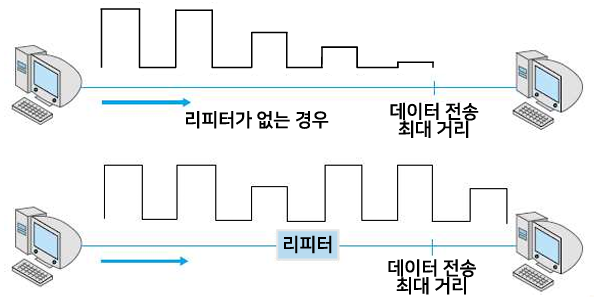

{:toc .large-only}

## 통신선로

### 점대점 선로 (Point-to-point line)

- 통신 네트워크의 기본 요소로 점대점으로 두 단말기를 연결하는 통신선로
- 전용선이라고도 함
- 연속적 데이터 전송에 적합
- 점대점 네트워크를 확장하여 성형(star) 네트워크 구축 가능

### 멀티드롭 선로 (Multidrop ine)

- 하나의 선로에 복수개의 단말기가 연결되어 공유하는 통신선로
- 전용선보다 통신선로의 효율성이 높음
- 데이터가 충돌할 수 있으므로 선로제어 프로토콜이 필요함
- 연결할 단말기 수의 제한 요인
  - 하드웨어와 소프트웨어의 처리능력
  - 단말기에서 발생하는 트래픽
  - 선로의 통신 속도 (대역폭)
  - 통신사업자에 의한 강제적 제약

### 집선 선로 (Line concentration)

- 다수 회선으로부터 호출을 집약하여 그보다 적은 수의 중계선으로 전송하는 통신선로
- 중심 부분에 집선장치를 설치한 후 여기에 단말기를 여러 대 연결함
- 출력 채널 수 < 입력 채널 수
- ex) 전화 교환망

## 전송 매체

컴퓨터 통신망에서 송신기와 수신기 간에 물리적인 데이터 전송로의 역할

### 하드와이어 매체 (유선 매체)

| 종류          |                                                               모양                                                               | 특징                                                                                                                                                  |
| ------------- | :------------------------------------------------------------------------------------------------------------------------------: | ----------------------------------------------------------------------------------------------------------------------------------------------------- |
| 꼬임선 케이블 |  | - 두 가닥의 절연된 구리성이 쌍으로 균일하게 꼬여 있음(간섭 현상 감소) - 하나의 쌍이 하나의 통신선로 역할을, 여러 개의 쌍이 하나의 케이블을 형성함 |
| 동축 케이블   |  | - 중심 도체(심선)와 외부 원형 도체가 서로 절연된 상태로 동일한 축을 형성함 - 장거리 전화망, 케이블 TV, LAN 등에 사용                              |
| 광섬유        |  | - 빛 신호를 전달하는 섬유 - 넓은 대역폭 - 감쇠율과 전자기적 간섭이 적음 - 설치 비용이 큼                                                  |

### 소프트와이어 매체 (무선 매체)

| 종류            |                                                               모양                                                               | 특징                                                                                                                                                                       |
| --------------- | :------------------------------------------------------------------------------------------------------------------------------: | -------------------------------------------------------------------------------------------------------------------------------------------------------------------------- |
| 지상 마이크로파 |  | - 접시형 안테나 (고지대에 설치) - 감쇠 현상, 간섭 현상이 있음                                                                                                          |
| 위성 마이크로파 |  | - 통신 위성 - 많은 대역폭 구성, 통신 비용의 감소 - 전송에 지연이 있음 - 점대점 통신만 가능 (지상국-지상국 통신) - 통신 위성 고장 시 모든 통신선로가 단절됨 |
| 라디오파        |  | - 다방향성 (접시형 안테나 불필요) - 방송 통신에 사용 - 다중경로 간섭이 생김                                                                                        |
| 적외선          |  | - 300~500GHz의 전자기파 - 단거리 통신용                                                                                                                                |

## 네트워크 형태

- 성형(star) 네트워크
- 환형(ring) 네트워크
- 버스형(bus) 네트워크
- 그물형(mesh) 네트워크
- 계층형(hierarchical) 네트워크 (=트리형 네트워크)

## 네트워크 장치

### 리피터 (Repeater)

- 전송되는 신호가 약해지거나 잡음 등에 대처하기 위해 원래의 신호를 재생시켜 다음 구간으로 재전송하는 장치
- 단순한 신호 증폭이 아니라 신호를 구분하여 재생함
- **물리 계층**에서 동작
- 여러 대의 리피터를 사용하여 장거리 데이터 전송 가능

### 허브 (Hub)

- 단순히 하나의 노드에서 수신한 신호를 정확히 재생하여 다른 노드로 보내는 장치
- 더미 허브, 스위칭 허브, 스태커블 허브 종류가 있음

### 브리지 (Bridge)

- 복수 개의 LAN을 연결하기 위한 장치
- 물리 주소(MAC 주소)를 사용하며 **데이터링크 계층**에서 동작
- 수신한 데이터의 전송 주소(MAC 주소)를 검사해서 목적지가 송신지와 다른 경우, 다른 LAN으로 전송해 줌

### 라우터 (Router)

- IP 네트워크끼리 연결하거나 IP 네트워크와 인터넷을 연결하기 위한 장치
- 네트워크 주소(IP 주소)를 사용하며 **네트워크 계층**에서 동작
- 송신지에서 수신지까지 최적의 경로를 선택하여 데이터 패킷을 전송해줌
- 오류가 있는 패킷을 검출하여 폐기함 (오류 제어)
- 정적 라우팅과 동적 라우팅 방법이 있음
- 브리지보다 패킷 전송 속도가 느리고 가격이 비쌈

### 게이트웨이 (Gateway)

- 서로 다른 통신 프로토콜을 사용하는 2개의 네트워크를 연결해주는 장치
- 통신 프로토콜이나 데이터 형식을 변환함
- **응용 계층**에서 동작
- 라우터에 비해 전송 속도가 느리며 가격이 비싸고 설치가 어려움
- 이미 구축되어 있는 두 네트워크가 서로 다른 Network Architecture로 이루어져 있다면 게이트웨이를 이용하여 하나의 네트워크처럼 사용할 수 있음

## 네트워크 소프트웨어

유무선 네트워크 계층에서 단말기들이 서로 약속된 프로토콜로 데이터를 교환할 수 있도록 하는 통신 소프트웨어

### 네트워크 애플리케이션

- 네트워크를 통해 데이터를 전송하거나 전송된 데이터를 수신하는 애플리케이션
- ex) 웹 브라우저, FTP

### 네트워크 운영체제 (Network Operation System: NOS)

- 네트워크의 트래픽과 대기열(큐)을 제어하고, 여러 명의 사용자가 파일과 같은 네트워크 자원에 접근할 수 있게 함
- 멀티 프로세싱, 로그온 제한, 접근 제어, 파일 관리 등의 기능 수행
