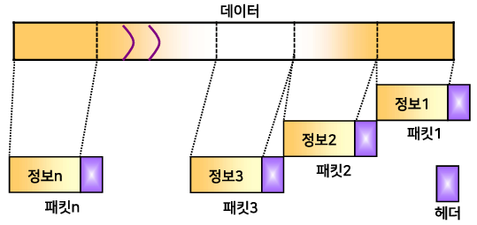
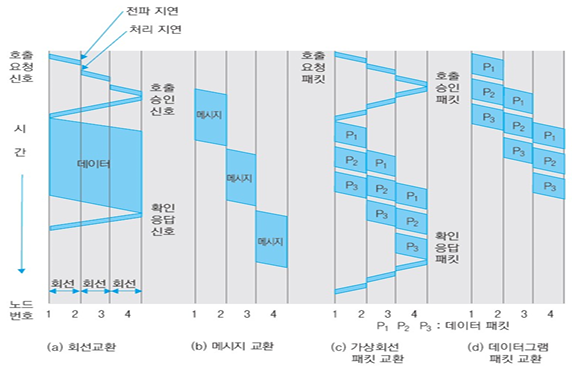
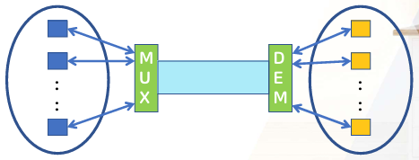
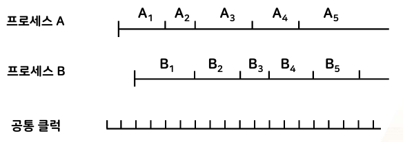
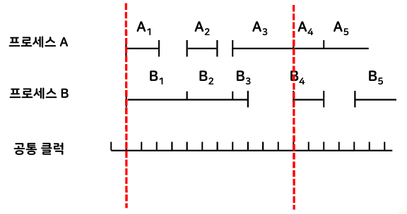

{:toc .large-only}

## 데이터 교환 방식

### 회선 교환

- 회선(circuit): 설정된 통신경로의 집합
- 연결지향형 전송
  - 연결 -> 데이터 전송 -> 연결 해제
- 전송 경로 점유 (전용선처럼 회선을 사용)
- 경로설정에 따른 전송 지연이 있음
- 연속적인 대용량 데이터 전송에 적합

### 패킷 교환

- 메시지를 일정한 크기로 분할하여 전송하는 방법
- 패킷(packet) = 제어 정보(header, tail) + 데이터(payload)
- 각 패킷마다 헤더가 붙기 때문에 오버헤드가 있음
- **주기억장치**를 사용하여 저장 후 전달하므로 전송 지연을 줄일 수 있음
- 짧은 실시간 전송에 주로 사용
- 연결지향형 방식인 가상회선 방식, 비연결형 방식인 데이터그램 방식이 있음

### 메시지 교환

- 데이터 크기에 관계 없이 데이터를 그대로 전송
- 헤더(목적지 주소) 필요
- 패킷 교환 방식보다 오버헤드가 적음
- 각 노드에서 수신 후 **보조기억장치**에 저장하면서 적절한 선로를 찾아 송신함
- 전송 지연이 길어서 실시간 서비스에는 부적절함
- 전송 중 오류가 발생하면 전체 메시지를 재전송해야 하므로 대역폭의 낭비가 발생함
- 대용량 데이터 전송에 적합

### 데이터 교환 방식 비교

| 종류                 | 전송 방식 | 용도                      | 특징                                           |
| -------------------- | --------- | ------------------------- | ---------------------------------------------- |
| 회선 교환            | 연결형    | 대용량 데이터 전송        | 메시지 분실 가능성 있음                        |
| 가상회선 패킷 교환   | 연결형    | 실시간 소용량 데이터 전송 | 메시지 재구성이 불필요함                       |
| 데이터그램 패킷 교환 | 비연결형  | 실시간 소용량 데이터 전송 | 메시지 재구성이 필요함                         |
| 메시지 교환          | 비연결형  | 대용량 데이터 전송        | - 메시지 분실 가능성 없음 - 전송 시간이 김 |

## 다중화 (Multiplexing)

- 여러 단말기들이 하나의 통신 선로의 용량을 나누어 쓸 수 있도록 해주는 방법
- 하나의 물리적 통신 선로를 여러 개의 논리적 채널로 나누어 공유
- 전송 자원 이용의 효율성 증가 및 통신망 구축 비용의 절감

### 시분할 다중화 방식

- Time Division Multiplexing (TDM)
- 복수 개의 데이터를 각각 일정한 시간(time slot)으로 분할하여 복수의 디지털 채널로 공유
- 낮은 속도의 데이터를 모아 높은 속도의 채널로 전송
- 비동기식 시분할 다중화, 통계적 시분할 다중화 방식이 있음

### 주파수 분할 다중화 방식

- Frequency Division Multiflexing (FDM)
- 여러 개의 낮은 속도의 데이터를 각각 다른 반송파 주파수에 변조하여 복수의 아날로그 채널로 공유
- 라디오 방송에 주로 사용

### 파장 분할 다중화 방식

- Wavelength Division Multiplexing (WDM)
- 광섬유의 고속 데이터 전송률을 이용하기 위해 설계됨
- 신호가 빛이라는 점 이외에는 주파수 분할 다중화와 동일한 개념

## 동기화 (Synchronization)

- 송신자와 수신자 사이에 데이터를 송수신하는 시점을 일치시킴으로써 데이터를 정확하게 송수신할 수 있게 하는 통신 방법
- 서로 다른 시점에 데이터를 송수신하여 발생되는 오류 문제를 해결함
- 송수신자가 서로 동일한 속도로 데이터를 송수신하도록 해줌
- 송수신자 사이의 표본화 펄스의 정확한 위치를 맞춤

### 비트 동기

- 두 지국이 독립된 각자의 클록을 가지고 있는 경우:
  - 제어지국의 동기정보를 이용하여 종속지국의 클록 속도를 수정함
- 한 지국만 클록을 가지고 있는 경우:
  - 송신하는 데이터 앞에 동기를 맞출 수 있도록 동기 신호를 함께 송신함
  - 종속지국은 이 동기 신호를 이용하여 표본화 위치를 결정함
- 두 지국이 모두 클록을 가지고 있으나, 종속지국에서 초기 몇 비트 동안만 클록을 사용하는 경우:
  - 클록을 동기시키고 난 뒤 종속지국은 자기의 클록을 사용함
- 송신지국의 클록은 시작신호에 의해서 시작되고, 몇 비트의 동기전송 후 정지신호를 보내 전송을 멈추게 한다.

### 프로세스 동기

두 개의 비동기 프로세스에 대해서 프로세스끼리 연관이 있어 순서가 보장되어야 하는 경우, 프로세스 간격을 조정하여 동기화한다.

