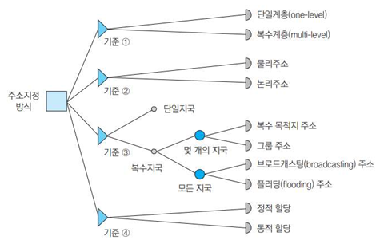
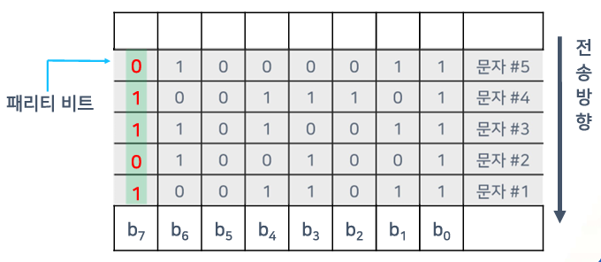
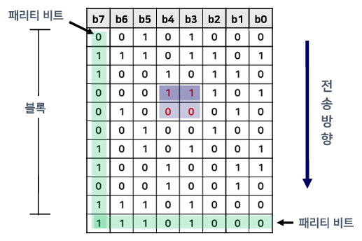
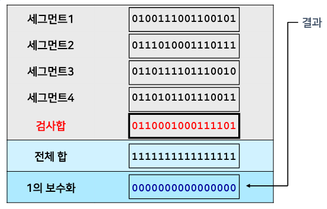
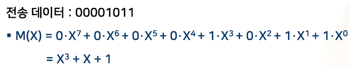
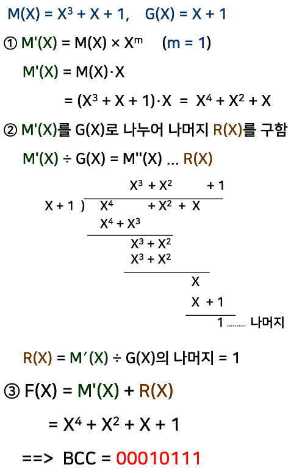
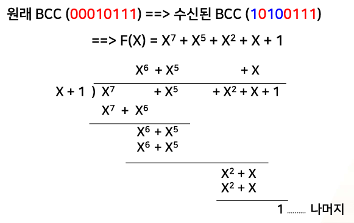

{:toc .large-only}

## 데이터 교환 방식

### 회선 교환

- 회선(circuit): 설정된 통신경로의 집합
- 연결지향형 전송
  - 연결 -> 데이터 전송 -> 연결 해제
- 전송 경로 점유 (전용선처럼 회선을 사용)
- 경로설정에 따른 전송 지연이 있음
- 연속적인 대용량 데이터 전송에 적합

### 패킷 교환

- 메시지를 일정한 크기로 분할하여 전송하는 방법
- 패킷(packet) = 제어 정보(header, tail) + 데이터(payload)
- 각 패킷마다 헤더가 붙기 때문에 오버헤드가 있음
- **주기억장치**를 사용하여 저장 후 전달하므로 전송 지연을 줄일 수 있음
- 짧은 실시간 전송에 주로 사용
- 연결지향형 방식인 가상회선 방식, 비연결형 방식인 데이터그램 방식이 있음

### 메시지 교환

- 데이터 크기에 관계 없이 데이터를 그대로 전송
- 헤더(목적지 주소) 필요
- 패킷 교환 방식보다 오버헤드가 적음
- 각 노드에서 수신 후 **보조기억장치**에 저장하면서 적절한 선로를 찾아 송신함
- 전송 지연이 길어서 실시간 서비스에는 부적절함
- 전송 중 오류가 발생하면 전체 메시지를 재전송해야 하므로 대역폭의 낭비가 발생함
- 대용량 데이터 전송에 적합

### 데이터 교환 방식 비교

| 종류                 | 전송 방식 | 용도                      | 특징                                           |
| -------------------- | --------- | ------------------------- | ---------------------------------------------- |
| 회선 교환            | 연결형    | 대용량 데이터 전송        | 메시지 분실 가능성 있음                        |
| 가상회선 패킷 교환   | 연결형    | 실시간 소용량 데이터 전송 | 메시지 재구성이 불필요함                       |
| 데이터그램 패킷 교환 | 비연결형  | 실시간 소용량 데이터 전송 | 메시지 재구성이 필요함                         |
| 메시지 교환          | 비연결형  | 대용량 데이터 전송        | - 메시지 분실 가능성 없음 - 전송 시간이 김 |

## 다중화 (Multiplexing)

- 여러 단말기들이 하나의 통신 선로의 용량을 나누어 쓸 수 있도록 해주는 방법
- 하나의 물리적 통신 선로를 여러 개의 논리적 채널로 나누어 공유
- 전송 자원 이용의 효율성 증가 및 통신망 구축 비용의 절감

### 시분할 다중화 방식

- Time Division Multiplexing (TDM)
- 복수 개의 데이터를 각각 일정한 시간(time slot)으로 분할하여 복수의 디지털 채널로 공유
- 낮은 속도의 데이터를 모아 높은 속도의 채널로 전송
- 비동기식 시분할 다중화, 통계적 시분할 다중화 방식이 있음

### 주파수 분할 다중화 방식

- Frequency Division Multiflexing (FDM)
- 여러 개의 낮은 속도의 데이터를 각각 다른 반송파 주파수에 변조하여 복수의 아날로그 채널로 공유
- 라디오 방송에 주로 사용

### 파장 분할 다중화 방식

- Wavelength Division Multiplexing (WDM)
- 광섬유의 고속 데이터 전송률을 이용하기 위해 설계됨
- 신호가 빛이라는 점 이외에는 주파수 분할 다중화와 동일한 개념

## 동기화 (Synchronization)

- 송신자와 수신자 사이에 데이터를 송수신하는 시점을 일치시킴으로써 데이터를 정확하게 송수신할 수 있게 하는 통신 방법
- 서로 다른 시점에 데이터를 송수신하여 발생되는 오류 문제를 해결함
- 송수신자가 서로 동일한 속도로 데이터를 송수신하도록 해줌
- 송수신자 사이의 표본화 펄스의 정확한 위치를 맞춤

### 비트 동기

- 두 지국이 독립된 각자의 클록을 가지고 있는 경우:
  - 제어지국의 동기정보를 이용하여 종속지국의 클록 속도를 수정함
- 한 지국만 클록을 가지고 있는 경우:
  - 송신하는 데이터 앞에 동기를 맞출 수 있도록 동기 신호를 함께 송신함
  - 종속지국은 이 동기 신호를 이용하여 표본화 위치를 결정함
- 두 지국이 모두 클록을 가지고 있으나, 종속지국에서 초기 몇 비트 동안만 클록을 사용하는 경우:
  - 클록을 동기시키고 난 뒤 종속지국은 자기의 클록을 사용함
- 송신지국의 클록은 시작신호에 의해서 시작되고, 몇 비트의 동기전송 후 정지신호를 보내 전송을 멈추게 한다.

### 프로세스 동기

두 개의 비동기 프로세스에 대해서 프로세스끼리 연관이 있어 순서가 보장되어야 하는 경우, 프로세스 간격을 조정하여 동기화한다.

## 주소 지정

- 컴퓨터 통신망에서 사용자를 식별하는 방법
- 문자 또는 수를 이용
- 주소 지정 기준
  - 계층의 수
  - 부 네크워크가 제공하는 주소 서비스의 종류 (논리/물리 주소)
    - 논리 주소: ex) 203.232.172.105 (32비트, 10진수)
    - 물리 주소: ex) 00:13:77:52:67:78 (48비트, 16진수)
  - 같은 주소를 갖는 지국의 수
  - 주소 할당 모드

## 오류

- 송신 데이터와 수신 데이터가 일치하지 않는 경우
- 송신 데이터가 주어진 시간 안에 수신측에 도착하지 못한 경우
- 오류 발생 이유: 열, 자기장, 간섭, 고장 등
- 잔류오류율(RER): 오류가 있는 비트 수 / 전송된 총 비트 수

### 오류 제어

- 잔류오류율을 주어진 한계 이내로 유지하는 기능
- 후진 오류 제어: 오류 검출 후 재전송
- 전진 오류 정정: 오류 검출 및 수정
- 오류 검출 방식: 패리티 검사, 검사합 검사, 순환 잉여 검사

### 패리티 검사

데이터 앞에 패리티 비트를 붙여서 전송

#### 단순 패리티 검사 (홀수 패리티 이용)

- 1의 개수를 홀수로 맞춤
- 문자 1의 데이터에 1의 개수가 짝수이므로 홀수로 맞추기 위해 패리티 비트를 1로 전송
- 데이터에 짝수 개의 비트 오류가 있는 경우 오류 검출이 불가능 (ex. 문자 1의 1 데이터 2개가 0으로 잘못 전송된 경우)

#### 2차원 패리티 검사 (짝수 패리티 이용)

- 2차원으로 패리티 검사
- 1의 개수를 짝수로 맞춤
- 2차원적으로 짝수 개의 비트 오류가 있는 경우 오류 검출이 불가능 (ex. 하이라이트 된 데이터가 각각 0->1, 1->0으로 잘못 전송된 경우)

### 검사합 검사

데이터 뒤에 검사합(Check Sum) 값을 붙여서 전송

#### 검사합 생성

1. 데이터를 세그먼트로 분할
2. 각 세그먼트를 2진수로 간주하여 합침 (캐리 비트가 있다면 같이 합침)
3. 합친 결과를 1의 보수로 만듦 (check sum)
4. 3의 검사합을 데이터 뒤에 붙여서 전송

#### 검사합 검사

1. 수신된 데이터를 세그먼트로 분할
2. 각 세그먼트를 2진수로 간주하여 합침 (캐리 비트가 있다면 같이 합침)
3. 합친 결과를 1의 보수로 만듦
4. 이 결과가 0이라면 오류가 없는 것

### 순환 잉여 검사 (CRC)

- 데이터를 블록 단위로 검사
- 블록 끝에 오류 제어 정보를 붙여서 전송 (BCC)
- 수신된 BCC를 동일한 생성다항식으로 나누어 나머지가 없으면 오류가 없는 것
- Block Check Character(BCC) 생성 과정
  - 비트의 다항식 M(X) 표현
  - 생성다항식 G(X)에 의한 부호화
- 사진, 소리, 영상 등의 데이터에 활용

#### 다항식 M(X) 표현

1. 전송한 비트를 X를 미지수로 하는 다항식으로 표현한다.
1. 가장 낮은 자리의 비트를 X0으로 표시하고 한 자리씩 올라갈 때마다 미지수 X의 차수를 1씩 올려주는 방식으로 표현한다.

#### 생성다항식 G(X)에 의한 부호화

#### 오류 검사 과정

### 귀환 오류 제어

- 송수신지국 사이의 역방향 채널을 이용하는 오류 제어 방법
- 오류 검출 장치의 위치에 따라 결정귀환, 정보귀환, 복합귀환으로 분류

#### 결정 귀환

- Automatic Repetition reQuest (ARQ)
- 수신 측에서 오류 검출
- 오류 제어를 위해 가장 많이 사용되는 방법
- 정지-대기(stop-and-wait) ARQ
  - 1개의 데이터 프레임을 송신하고 기다림
  - ACK를 수신하면 다음 프레임을 송신 후 기다림
  - REJ를 수신하면 처음 프레임을 재송신 후 기다림
- 연속적(continuous) ARQ
  - 여러 개의 데이터 프레임을 송신하고 기다림
  - go-back-N ARQ
    - sliding window 프로토콜을 사용
  - Selective-Repeat ARQ
    - REJ가 수신된 프레임만 재전송
- 적응적(adaptive) ARQ
  - 프레임의 길이를 동적으로 변화시키는 방법
  - 오류 발생률이 높으면 짧은 프레임으로 전송

#### 정보 귀환

- 송신 측에서 오류 검출

#### 복합 귀환

- 양측에서 오류 검출
- 효율성이 낮고 복잡함

### 전진 오류 정정

- 송신측이 전송할 프레임에 부가적인 정보를 첨가하여 전송함으로써 수신측에서 오류 검출 및 정정까지 할 수 있는 방식
- 연속적인 데이터의 흐름이 필요하고 역방향 채널의 제공이 어려울 때 사용 (ex. 지구에서 목성 탐사선에 데이터를 전송할 때)
- 데이터 프레임에 잉여 비트를 추가하여 오류 정정 코드를 전송
  - 해밍(Hamming) 코드
  - 리드-뮬러(Reed-Muller) 코드
  - 리드-솔로몬(Reed-Solomon) 코드
- 잉여 비트의 크기만큼 전송 효율이 떨어지는 단점이 있음
