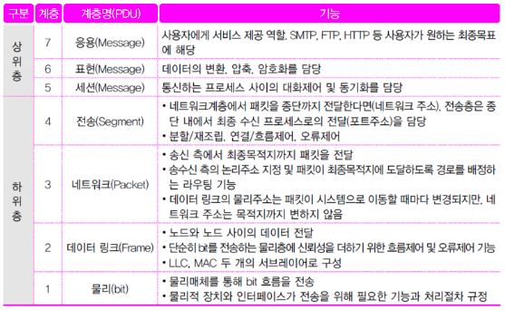
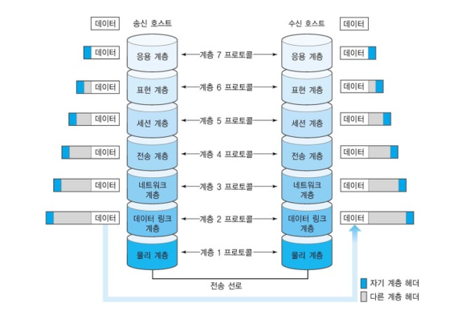

{:toc .large-only}

## 컴퓨터 통신망 구조

### 네트워크 아키텍처

- 컴퓨터 통신망의 물리적 요소들과 기능, 구성, 동작, 통신 프로토콜 등을 위한 프레임워크
- 폐쇄형 네트워크: IBM의 SNA, DEC의 DNA, Honeywell의 DSA
- 개방형 네트워크: OSI 참조 모델, TCP/IP

| 항목      | OSI 참조 모델               | 인터넷 통신망 구조(TCP/IP)                                       |
| --------- | --------------------------- | ---------------------------------------------------------------- |
| 주요 특징 | 개방형 시스템 상호 연결     | 전송제어 및 인터넷 프로토콜                                      |
| 의미      | 컴퓨터 통신망의 이론적 모델 | 인터넷을 통해 데이터를 전송하는 데 사용되는 클라이언트-서버 모델 |
| 레이어 수 | 7                           | 4                                                                |
| 개발 주체 | ISO(국제표준기구)           | DoD(미국 국방성)                                                 |

## OSI 참조 모델

- 1984년에 ISO가 표준 ISO 7498라는 이름으로 출판
- 서로 다른 통신 시스템 간의 통신을 위한 표준
- 7단계의 계층 구조

#### 물리 계층 (Physical Layer)

- 물리적인 전송 매체(케이블, 무선 등)를 통해 비트 데이터를 전기적, 광학적, 무선 신호로 변환하여 송수신함
- 장치 간의 물리적 연결, 유지, 해제를 담당

#### 데이터 링크 계층 (Data Link Layer)

- 인접 장치(노드) 간의 데이터 전송
- 데이터의 신뢰성을 보장하기 위해 흐름 제어, 오류 검출 및 복구, 매체 접근 제어(MAC) 등을 수행

#### 네트워크 계층 (Network Layer)

- 발신지에서 목적지까지 경로를 선택(라우팅)하고 패킷을 전달
- 서로 다른 네트워크 간의 통신을 가능하게 하는 논리 주소(IP 주소) 사용

#### 전송 계층 (Transport Layer)

- 포트 번호로 최종 프로세스에 전달
- 신뢰성 있는 데이터 전송
- 데이터 분할 및 재조립, 흐름 제어, 오류 제어 등을 수행
- TCP, UDP 프로토콜이 이 계층에 속함

#### 세션 계층 (Session Layer)

- 통신 중인 두 응용 프로그램 간의 세션 설정 및 유지
- 동기화 및 대화 제어 기능 수행

#### 표현 계층 (Presentation Layer)

- 데이터를 응용 프로그램이 이해할 수 있는 형식으로 변환
- 압축, 암호화/복호화 담당

#### 응용 계층 (Application Layer)

- 최종 사용자에게 네트워크 서비스 제공
- 웹 브라우징(HTTP), 파일 전송(FTP), 이메일(SMTP, POP3), DNS 등

### 계층 분리 원칙

1. 너무 많은 계층으로 분리하지 않아야 한다.
1. 서비스의 양이 적고 최소의 상호 작용이 일어나도록 경계를 정해야 한다.
1. 명백히 서로 다른 기능을 수행하도록 계층을 설정한다.
1. 비슷한 기능들은 같은 계층에 존재하도록 한다.
1. 과거의 경험에 의해 성공적이라 판단되는 곳에 경계를 설정한다.
1. 쉽게 세분화되는 기능을 하나의 계층으로 한다.
1. 표준화된 인터페이스를 가질 수 있는 곳에 경계를 설정한다.
1. 구문(syntax), 의미(semantic) 등 추상적 개념의 수준이 다른 곳에 계층을 설정한다.
1. 각 계층은 상위 계층과 하위 계층 외에 다른 계층과는 무관하도록 한다.

### 캡슐화

- 데이터에 각 계층의 제어 정보를 추가하는 것
- 호스트 간의 통신은 두 호스트의 동등한 계층 간의 통신에 의해 이루어짐
  - 계층 간의 데이터 전송 단위를 PDU라고 하며, 이것은 상위 계층에서 전송을 원하는 데이터인 SDU에 제어정보인 PCI가 덧붙여진 형태로 전송된다.

