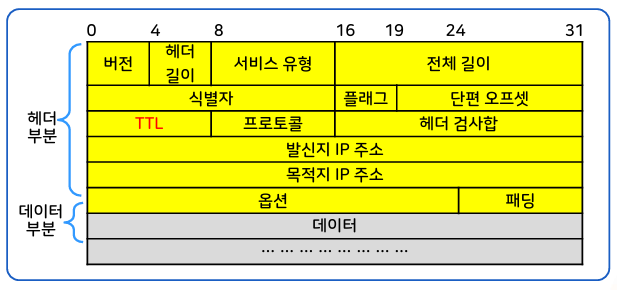
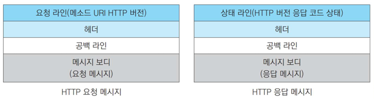
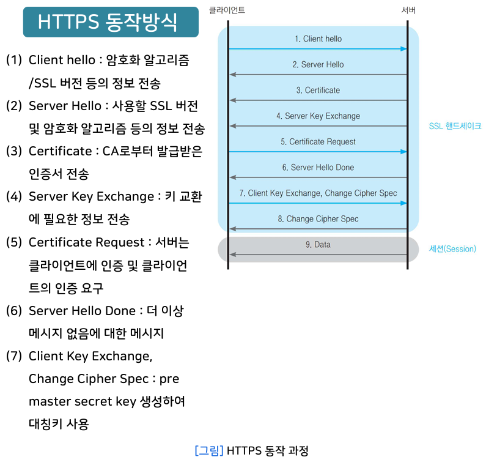
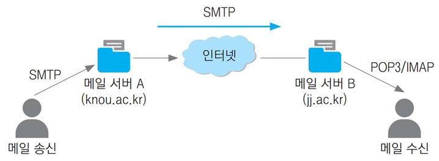

{:toc .large-only}

## TCP/IP

- 인터넷 통신망 구조
- 미국 국방성 DoD의 ARPA(Advanced Research Project Agency)에서 개발
- DoD 모델 또는 ARPA 모델이라고도 함

## TCP/IP 4계층

### 데이터 링크 계층

- 네트워크 인터페이스 계층(Network Interface Layer) 혹은 네트워크 접근 계층(Network Access Layer)
- 주요 프로토콜: ARP, RARP

#### ARP

- Address Resolution Protocol
- 상대방 호스트의 IP 주소만 알고 있을 때 상대방 호스트의 물리주소(MAC 주소)를 얻기 위해 사용
- IP 주소를 물리주소로 매핑해 주는 프로토콜
  - IP 주소는 32bit, 물리 주소는 48bit
- 요청 메시지는 broadcast 방식으로 전송 (모든 호스트에게 보냄)
- 응답 메시지는 unicast 방식으로 전송 (한 호스트에게만 보냄)

#### RARP

- Reverse Address Resolution Protocol
- 물리주소만 알고 있는 호스트가 자신의 IP 주소를 찾을 때 사용하는 프로토콜
- 일반적인 호스트의 IP 주소는 디스크에 저장된 구성 파일에서 확인할 수 있지만, 디스크가 없는 호스트는 물리주소를 이용하여 IP 주소를 얻을 수 있다.
- 브로드캐스트로 네트워크 전체에 자신의 물리주소를 전송하면 RARP 서버에서 IP 주소를 응답함
- RARP 서버는 MAC 주소와 IP 주소의 매핑 테이블을 관리
- RARP 서버가 미리 설치되어 있어야 함

### 네트워크 계층

- 인터넷 계층이라고도 함
- 발신지에서 목적지까지 경로를 선택(라우팅)하고 패킷을 전달
- 서로 다른 네트워크 간의 통신을 가능하게 하는 논리 주소(IP 주소) 사용
- 대표적인 프로토콜: IP, ICMP, IGMP

#### IP

- 네트워크 계층 프로토콜
- **비연결형** 전송 서비스
  - 신뢰성이 없는 데이터 전송
- 네트워크 계층의 투명성을 제공함
- 호스트의 주소 지정 및 데이터그램 전송
- 경유해야 하는 데이터 링크 및 라우터 정보를 무시
  - 수신자 호스트까지 경유해야 하는 데이터 링크 및 라우터에 관한 세부사항을 알지 못해도 데이터그램을 전송할 수 있음
- 데이터그램: IP 계층의 패킷
  - 데이터그램은 전송 중 적합한 크기로 분할되었다가 목적지 호스트에서 재조립됨

- 버전: IP version 식별번호
- 헤더 길이: 20~60 bytes (1 word = 4byte)
- 서비스 유형:
  - 3 비트: 우선순위
  - 4 비트: 서비스 유형(QoS)
  - 1 비트: 사용하지 않음
- 식별자: 데이터그램이 단편화 되었을 때 각 단편은 동일한 식별자를 가짐
- 플래그: 단편화(패킷 분할) 제어 필드
- 단편 오프셋: 메시지가 단편화 되었을 때 데이터의 원래 위치를 나타냄
- TTL
  - 데이터그램이 폐기되기 전까지 남은 활동 기간
  - 거칠 수 있는 최대 라우터 수. 보통 두 호스트 사이의 라우터 수x2로 설정
  - 라우터를 지날 때마다 1씩 감소하고 0이 되면 폐기됨
- 프로토콜
  - 상위 계층 프로토콜 식별 필드

#### 라우팅

- IP 데이터그램을 목적지 호스트까지 경유할 경로를 결정하는 것
- 호스트는 자신의 물리적 네트워크에 연결된 라우터 정보를 자신의 **라우팅 테이블**에 관리함
  - 라우팅 테이블에는 서브넷 마스크, 목적지 IP 주소, 다음홉 라우터의 IP 주소, 플래그, 참조 횟수 등이 저장됨
- IP의 라우팅은 송수신자와 그 사이에 있는 모든 라우터들이 IP 데이터그램 전달에 관여하지만, TCP의 라우팅은 송수신자만 TCP 세그먼트 전달에 관여함

#### ICMP

- Internet Control Message Protocol
- 전송 오류 제어
  - IP 데이터그램 전송의 오류가 발생할 경우 오류 메시지 또는 제어 메시지를 제공해주는 프로토콜
  - 오류를 라우터나 발신지 호스트에게 보고하는 메커니즘 제공
    - 오류를 수정하지 않고 보고만 수행
- 메시지 유형
  - 오류 보고 메시지
    - 발신지 억제: 데이터그램이 라우터나 호스트를 처리 능력을 초과한 경우
    - 시간 초과: TTL 필드의 값이 0이 되어 폐기된 경우
    - 목적지 도달 불가: 라우터가 데이터그램을 최종 목적지에 전달할 수 없는 경우
    - 재지정: 다른 라우터를 통해 보다 좋은 경로로 전달하는 경우
  - 질의 메시지
    - 에코 요청 및 응답: 두 호스트 사이에 통신이 가능한지 확인
    - 주소 마스크 요청 및 응답: 호스트가 라우터에 서브넷 마스크 요청
    - 타임 스탬프 요청 및 응답: 두 시스템 간에 IP 데이터그램이 오가는데 필요한 시간 결정
    - 라우터 요청 및 응답: 다른 네트워크의 호스트에게 라우터의 주소를 요청

#### IGMP

- Internet Group Management Protocol
- 인터넷에서 multicast 서비스를 위해 사용되는 프로토콜
- IP 호스트가 어떤 멀티캐스트 그룹에 참가하고 있는지를 멀티캐스트 라우터에 통보하는 프로토콜
- 클래스 D 주소 사용
- 멀티캐스트: 하나의 그룹에 속한 호스트들에게 메시지 전송
- 멀티캐스트 그룹이 아닌 프로세스도 멀티캐스트 메시지 전송 가능
- IGMP 질의 및 보고 메시지를 통해 그룹 가입 및 탈퇴 가능

#### IP 주소 (인터넷 주소)

- 서로 다른 네트워크 간에 호스트를 식별하는 논리 주소
- A, B, C, D, E 5개 종류의 클래스가 있음
  - 클래스 A: 비트 0으로 시작되며 네트워크 식별을 위해 7개 비트를 사용
  - 클래스 B: 비트 10으로 시작되며 네트워크 식별을 위해 14개 비트를 사용
  - 클래스 C: 비트 110으로 시작되며 네트워크 식별을 위해 21개 비트를 사용
  - 클래스 D: 비트 1110으로 시작되며 네트워크나 호스트 식별보다는 멀티캐스트 서비스를 위해 사용
  - 클래스 E: 비트 1111로 시작되며 향후 서비스를 위해 예약(reserved)된 IP 주소 형태
- IPv4는 4바이트(32비트), IPv6은 16 바이트(128 비트)

#### IP 주소 관리 방법

- Host Table
  - 모든 IP 주소와 매핑되는 호스트 이름으로 구성된 테이블
  - 중앙집중형 관리 방식
  - 호스트의 증가와 변화에 대응하기 어려움
- DNS (Domain Name System)
  - 계층적 구조 및 분산 관리
  - name server는 특정 네트워크 영역의 정보만 가지며 다른 영역에 대해서는 다른 name server의 정보를 참조함
  - 데이터가 복잡하며 수작업에 의한 오류 가능성이 있음
- BOOTP (Bootstrap Protocol)
  - 동적으로 IP 주소를 할당
  - 디스크가 없는 호스트에 대해 주소 및 설정 정보를 자동으로 할당하고 관리하는 프로토콜
- DHCP (Dynamic Host Configuration Protocol)
  - 응용계층 프로토콜
  - BOOTP에서 발전된 동적 주소 할당 프로토콜로써 IP 주소 재사용이 가능함
  - 메시지 형식은 BOOTP와 동일함
  - IP 주소를 중앙에서 관리하고, IP 주소 pool에서 사용 가능한 IP 주소를 선택하여 호스트에게 일정기간 임대해줌

### 전송 계층

- 시스템 종단에서 투명한 데이터를 양방향을 전달하는 계층
- 프로세스 구별을 위해 포트 번호를 사용하여 전송
- 오류 복구와 흐름 제어를 통해 신뢰성 있는 데이터를 전송
- 연결 제어, 데이터 단편화/재조립 기능
- 주요 프로토콜: TCP, UDP (인터넷에서 가장 많이 사용되는 프로토콜)

#### UDP

- User Datagram Protocol
- **비연결형** 전송 서비스
  - 신뢰성이 없는 데이터 전송
  - 데이터 손실 가능성이 있음
  - 데이터 순서를 보장할 수 없음
  - 호스트 사이의 데이터 흐름 제어 없음
- UDP 헤더는 포트 번호만 가지고 있음
- TCP보다 데이터 전송 속도가 빠르고 응용 프로그램이 간단함
- 기본적인 IP 데이터 전달 서비스에 프로세스 간 통신이 추가된 형태
- 연결성 보장과 신뢰적 전송에 소요되는 오버헤드가 없음
- 간단한 메시지를 송수신하는 데 적합
- 최소한의 신뢰성을 위한 오류제어 메커니즘으로 검사합(checksum) 기능을 옵션으로 제공

- UDP 발신지 포트: 발신지 프로세스 포트 번호
- UDP 목적지 포트: 목적지 프로세스 포트 번호
- UDP 전체 길이: 데이터 그램 전체 길이(헤더 길이+데이터 길이)
- UDP 검사합: 데이터그램 전체의 오류 검사용 필드
- UDP 가짜헤더(Pseudo Header):
  - 검사합(checksum)을 계산하기 위해 사용하는 임시 헤더 (12바이트)
  - IP 헤더로부터 얻음
  - UDP 데이터그램이 정확히 목적지에 도착했는지 2중으로 인증 (IP 주소 확인, 오류 검증(검사합))
  - 가짜헤더 12바이트 + UDP헤더 + UDP데이터를 16비트 검사합하여 UDP 검사합 필드에 저장
  - 가짜헤더와 패딩은 실제로 전송되지 않아 길이에 포함되지 않음

#### TCP

- Transmission Control Protocol
- **연결형** 전송 서비스
  - 신뢰성 있는 데이터 전송
  - 흐름 제어 (sliding window protocol)
  - 오류 제어 (응답 패킷, 중복 패킷 방지, 시간초과, 타이머 재전송)
  - UDP는 응용 프로그램에서 신뢰성을 보장해야 하지만 TCP는 전송 계층에서 신뢰성 보장
- TCP 연결 식별자: 송/수신측 TCP 종점 주소 (socket address)
  - 호스트 IP 주소 + 포트 번호
- 전이중(full-duplex) 데이터 전송 서비스
- 데이터를 전송하기 전에 발신지와 목적지 간에 가상경로를 설정하고 데이터 전송 후 해제
- 세그먼트(Segment) 단위의 전송
  - 모든 세그먼트는 가상경로를 통해 전송
- 방대한 양의 데이터 전송에 적합

- UDP 발신지 포트: 발신지 TCP 사용자 프로세스 식별
- UDP 목적지 포트: 목적지 TCP 사용자 프로세스 식별
- 순서번호(sequence number): 데이터 필드의 첫 번째 데이터 바이트의 순서 번호
- 응답번호(ACK number): 바로 다음에 받기를 기대하는 순서 번호
- 제어(flag):
  - URG: 긴급 포인터 필드가 유효함을 표시함
  - ACK: 응답번호가 유효함을 표시함
  - PSH: 가능한 빨리 현재 세그먼트를 상위 계층에 전달해야 함
  - RST: 연결을 재설정함
  - SYN: 연결을 초기화하기 위해 순서번호를 동기화시킴
  - FIN: 연결을 해제시키기 위해 현재 세그먼트가 마지막 데이터임을 표시함

#### 포트 주소

- 프로세스를 식별하는 포트 번호
- TCP 및 UDP에 의해 응용 프로그램을 식별
- 2바이트(16비트)로 구성

### 응용 계층

- 웹 사이트에 접속할 때 필요한 프로토콜과 프로그램(서비스)이 있는 계층
- 최종 사용자에게 네트워크 서비스 제공
- TCP 및 UDP를 통해 유용한 기능을 수행
  - 일반 사용자들은 TCP/UDP에 직접 접속하지 않고, 응용 계층을 통해 통신 서비스를 사용
  - 프로세스 구별을 위해 포트 번호 필요
- 주요 프로토콜: HTTP, FTP, SMTP, DNS 등
  - TCP 이용: HTTP, FTP, SMTP, Telnet 등
  - UDP 이용: TFTP, DNS, BOOTP 등
  - IP 직접 이용: traceroute 프로그램
  - ICMP 직접 이용: ping 프로그램

| 프로토콜 | 포트번호 |
| -------- | -------- |
| HTTP     | 80       |
| HTTPS    | 443      |
| FTP      | 20, 21   |
| Telnet   | 23       |
| SMTP     | 25       |
| DHCP     | 67, 68   |
| POP3     | 110      |

#### HTTP

- Hyper Text Transfer Protocol
- 클라이언트가 사이트 요청하는 것에 대해 서버가 응답하는 방식
  - 클라이언트는 HTML 파일 등 얻고 싶은 요청 정보를 전송
  - 서버는 헤더 정보와 함께 요청받은 데이터를 응답
- 무상태(Stateless)와 비연결성(Connectionless)
  - 모든 요청과 응답은 이전 요청/응답에 상관없이 독립적
  - 요청할 때마다 정보를 다시 보내야 함
  - 무상태의 단점을 보완하기 위해 쿠키, 세션 등을 사용
- 불특정 다수를 대상으로 하는 서비스에 적합
- 요청 메시지와 응답 메시지로 구분
  - 요청(상태) 라인, 헤더, 공백 라인(필수), 메시지 보디로 구성

#### HTTPS

- Hyper Text Transfer Protocol over Secure Socket Layer
- HTTP의 보안이 강화된 버전
- 대칭키와 공개키 모두 사용
  - 데이터 전송을 위해 대칭키 사용
  - 대칭키를 안전하게 전달하기 위해 공개키 사용
- SSL이나 TLS 프로토콜을 통해 세션 데이터를 암호화
  - 서버가 클라이언트로 서비스의 정보와 서버의 공개키가 포함된 인증서를 전송
  - CA의 공개키를 이용해 인증서를 복호화하여 서버의 공개키를 얻음

#### FTP

- 가장 일반적인 파일 공유 방법이나, HTTP 프로토콜, 클라우드 서비스 등으로 인해 사용이 줄어듦
- FTP 서버와 FTP 클라이언트 간에 접속
  - 21번 포트: 클라이언트가 서버에 연결할 때 사용 (FTP 명령어 전송용)
  - 20번 포트: 서버가 클라이언트로 데이터 연결 시 사용 (실제 파일 전송용)
- 능동 모드(active mode)
  - 클라이언트가 임의의 포트를 서버에 알려주면 서버에서 클라이언트가 알려준 포트로 접속함
- 수동 모드(passive mode)
  - 서버가 클라이언트에 임의의 포트를 알려주면 클라이언트는 서버가 알려준 포트로 접속함 (더 안전)

#### SFTP

- SSH 파일 전송 프로토콜
- 신뢰할 수 있는 데이터 흐름을 통해 파일 접근, 파일 전송, 파일 관리를 제공
- 하나의 연결만 필요하므로 안정적
- 소프트웨어 간 호환성 문제 발생 가능

#### TELNET

- 원격지의 컴퓨터를 이용하는 가상 단말 기능을 실현하기 위한 프로토콜
- 모든 플랫폼에서 사용 가능
- 사용자 아이디/패스워드 필요
- 터미널과 호스트와의 일대일 대칭 관계
- NVT(Network Virtual Terminal) 사용: 클라이언트와 서버 시스템의 버전이 달라도 데이터를 변환시켜 주는 장치

#### 메일 관련 프로토콜

- SMTP: 메일을 송신할 때 사용하는 프로토콜로써, TCP/IP 호스트 사이의 메일을 전달할 때 사용된다.
- POP3: 메일을 전송받을 때 사용하는 프로토콜로써, 로컬에서 메일을 수정, 삭제해도 메일서버에는 변화가 없다.
- IMAP: POP3의 단점인 비동기성을 보완하기 위한 방식. 로컬마다 데이터가 다르지 않고 어떤 디바이스에서 메일을 열든 동일하게 동기화하는 방식을 사용한다.

