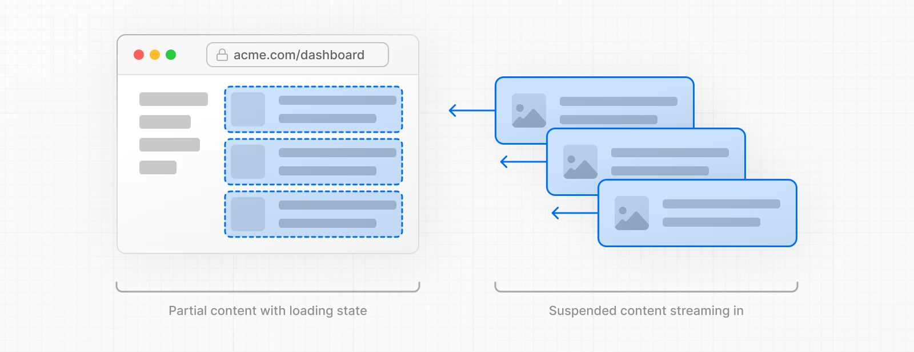
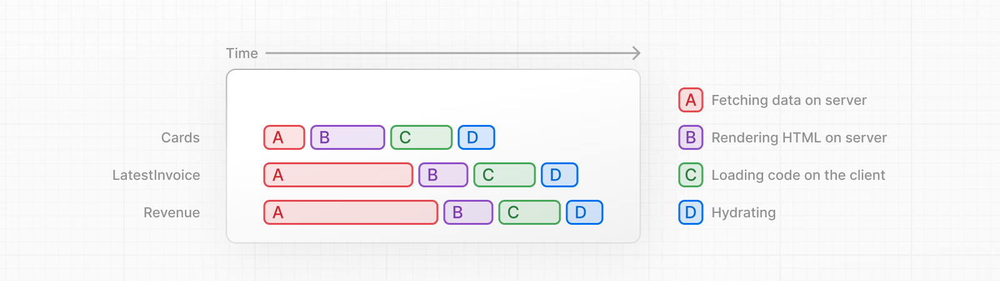
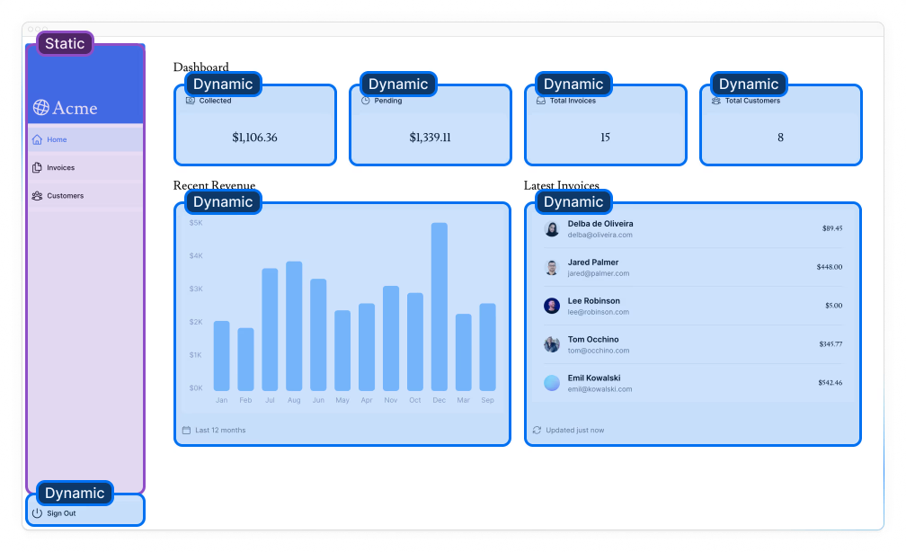
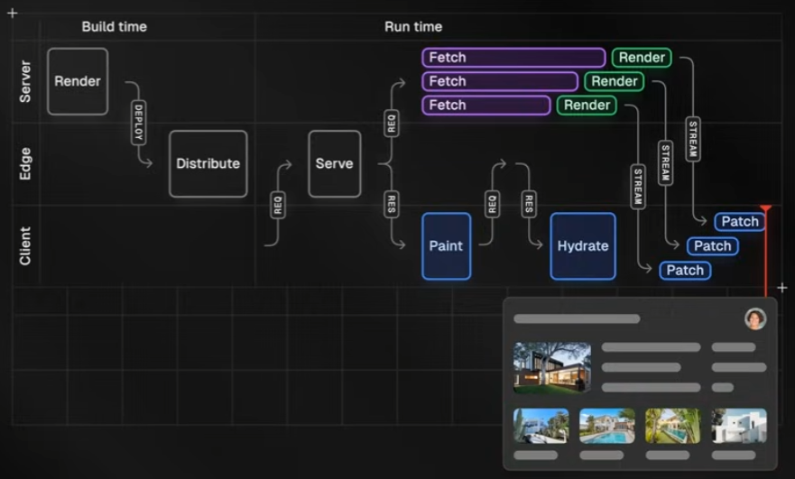

{:toc .large-only}

## 정적 렌더링

- 빌드 시점(배포) 또는 데이터 재검증 시점에 서버에서 미리 렌더링 해놓는 것을 뜻한다.
- 미리 만들어져 있는 정적인 페이지를 캐시하여 페이지 로딩 속도를 빠르게 할 수 있다.
- 데이터가 없거나 정적인 페이지에 유용하다.

## 동적 렌더링

- 동적 API를 호출하거나 데이터가 캐시되지 않은 경우 동적으로 렌더링한다.
- '동적'이라는 뜻은 바뀔 수 있다는 의미이며, 요청 시점에서만 알 수 있는 정보로 페이지를 렌더링 할 수 있다.
- 비용이 많이 드는 데이터는 캐시 처리하거나, 분할하여 스트리밍 할 수도 있다.

### 동적 API

- 사전 렌더링 시점에 알 수 없는 정보(ex. 쿠키, 헤더 등)로 API를 요청하는 경우 동적 API라고 한다.

## 스트리밍

스트리밍은 서버에서 데이터를 청크로 분할하여 클라이언트에게 **점진적으로** 전송할 수 있는 기술이다.



스트리밍 기법을 통해 사용자는 서버의 느린 데이터 페치가 완료될 때까지 기다리지 않고 페이지의 일부를 보고 상호작용 할 수 있다.



스트리밍을 구현하는 방법에는 라우팅 경로에 `loading.tsx` 파일을 생성하거나, `<Suspense>` 컴포넌트를 사용하는 방법이 있다.

### 스트리밍의 원리

- 서버에서는 html 파일을 점진적으로 로드하는데, 데이터를 페치하는 동안 노출할 fallback UI와 데이터 페치가 완료된 후 데이터를 노출할 곳을 미리 표시한 placeholder를 먼저 전송한다.
  - (이 때 placeholder는 비어 있다.)

```jsp
<Suspense fallback={<div>loading...</div>}>
  <DynamicContent />
</Suspense>

<!-- 위 리액트 코드는 아래 형식의 html 청크로 전송된다. -->
<!--$?-->
<div>
    <template id="B:0"></template>
    <div>loading...</div>
<div>
<!--/$-->
```

- `<!--$?-->`, `<!--/$-->` 표시는 리액트에서 정의한 리터럴로 Suspense 경계를 식별하는데 사용된다.
- 이후 데이터 페칭이 완료되면 서버는 후속 데이터 청크를 전송한다.

```html
<div hidden id="S:0">
  <p>Hello, World!</p>
</div>
<script>
  $RC = function (b, c, e) {
    ...
  };
  $RC("B:0", "S:0");
</script>
```

- `$RC` 함수는 fallback UI를 숨기고 새로운 데이터(S:0)를 삽입하는 역할을 한다.

### 참고사이트

- [Nextjs 앱라우터 이해해보기](https://wnhlee.dev/posts/app-router/#nextjs-%EC%97%90%EC%84%9C%EC%9D%98-streaming)
- [Next.js 13 - streaming SSR + Suspense](https://velog.io/@gygy/SSR%EC%9D%84-%EC%A7%81%EC%A0%91-%EA%B5%AC%ED%98%84%ED%95%B4%EB%B3%B8%EB%8B%A4%EB%A9%B4-feat.Next.js-13#streaming-html)
- [리액트 서버 컴포넌트의 동작 방식](https://yceffort.kr/2022/01/how-react-server-components-work#rsc-wire-format)

## 부분 사전 렌더링

- NextJS 14 버전부터 도입된 정적 렌더링과 동적 렌더링을 결합할 수 있는 렌더링 모델
- 동적 컨텐츠에 `<Suspense>` 컴포넌트를 사용하여 구현
- 정적 컨텐츠는 사전 렌더링하고, 동적 콘텐츠는 스트리밍으로 렌더링
- 실험적 기능이며 아직 프로덕션은 지원X
  - 개발 모드에서는 데이터를 페칭하는 동안 html 문서에 fallback UI가 내려오지만, 빌드 모드에서는 동적 렌더링까지 완료된 후 html 문서가 전송되는 것 같음



### 부분 사전 렌더링 과정

1. 배포 시점에 부분적으로 사전 렌더링 된 정적 컨텐츠가 배포된다.
1. 사용자가 페이지를 방문하면 1번에서 만든 정적 컨텐츠를 즉시 렌더링하고, 동적 컨텐츠 렌더링을 서버에 요청해놓는다.
1. 클라이언트는 정적 자산(폰트, 이미지, 스크립트)을 다운로드하며 사전 렌더링된 HTML을 화면에 그리기 시작한다. React는 유저 인터페이스를 hydrate해서(자바스크립트 이벤트와 상태를 연결하는 과정) 상호작용이 가능하게 만든다.
1. 서버에서 동적 컨텐츠의 청크가 준비되면 클라이언트에 스트리밍한다.
1. 클라이언트는 fallback UI를 동적 콘텐츠로 대체한다.



### 참고사이트

- [Next.js Visually Explained: Partial Pre-rendering (PPR)](https://youtu.be/MTcPrTIBkpA)
