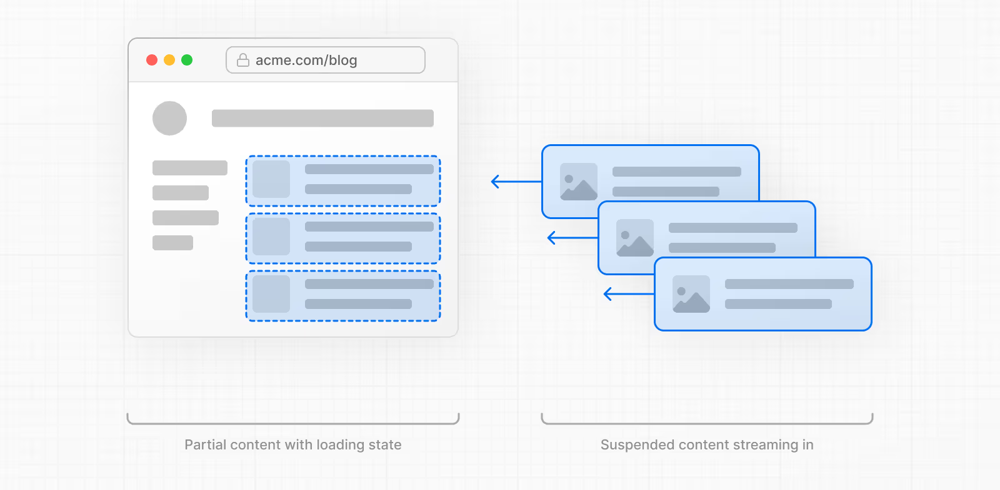

## Suspense

`<Suspense>`는 자식 요소를 로드하기 전까지 화면에 대체 UI(Fallback)를 보여주는 React의 기능이다.

```js
<Suspense fallback={<Loading />}>
  <Albums />
</Suspense>
```

Suspense는 children에 필요한 **모든 코드와 데이터를 로딩할 때까지** loading fallback을 보여준다.

Suspense는 아래 데이터에 대해서만 활성화된다.

- Relay와 Next.js 같이 Suspense가 가능한 프레임워크를 사용한 데이터 가져오기
- `lazy`를 활용한 지연 로딩 컴포넌트
- `use`를 사용해서 캐시된 Promise 값 읽기

```js
// lazy를 활용한 지연 로딩 컴포넌트
import { Suspense, lazy } from "react";

const Chart = lazy(() => import("./Chart"));

export default function Analytics() {
  return (
    <div>
      <h1>분석</h1>

      <Suspense fallback={<div>차트 로딩 중...</div>}>
        <Chart />
      </Suspense>
    </div>
  );
}
```

```js
// use를 사용해서 캐시된 Promise 값 읽기
export default function Albums({ artistId }) {
  const albums = use(fetchData(`/${artistId}/albums`));
  return (
    <ul>
      {albums.map(album => (
        <li key={album.id}>
          {album.title} ({album.year})
        </li>
      ))}
    </ul>
  );
}

export default function ArtistPage({ artist }) {
  return (
    <>
      <h1>{artist.name}</h1>
      <Suspense fallback={<Loading />}>
        <Albums artistId={artist.id} />
      </Suspense>
    </>
  );
}
```

또한 Effect 또는 이벤트 핸들러 내부에서 가져오는 데이터는 감지하지 않는다.

Suspense는 **컴포넌트가 렌더링 중에 Promise를 throw 할 때만** 이를 감지하여 fallback UI를 보여주는데, useEffect는 컴포넌트의 렌더링이 끝난 후 실행되기 때문에 Suspense는 이 상황을 감지할 수 없다.

```js
console.log("1. 컴포넌트 함수 실행 시작");

function Component() {
  console.log("2. 렌더링 단계");

  const [data, setData] = useState(null);

  useEffect(() => {
    console.log("4. 이펙트 실행 (렌더링 완료 후)");
    // 이 시점에는 이미 Suspense 판단이 끝남
    fetchData().then(setData);
  }, []);

  console.log("3. JSX 반환");
  return <div>{data || "로딩..."}</div>;
}
```

## Next.js에서의 Suspense 사용

Next.js의 App Router에서 Suspense는 동적 경계를 표시하는 데 사용된다.

```js
import { Suspense } from "react";
import StaticComponent from "./StaticComponent";
import DynamicComponent from "./DynamicComponent";
import Fallback from "./Fallback";

export const experimental_ppr = true;

export default function Page() {
  return (
    <>
      <StaticComponent />
      <Suspense fallback={<Fallback />}>
        <DynamicComponent />
      </Suspense>
    </>
  );
}
```

Next.js는 빌드 시 StaticComponent와 fallback UI를 미리 렌더링하고, Suspense 안의 DynamicComponent는 사용자가 해당 페이지에 접근할 때 **스트리밍**된다.



스트리밍은 경로를 여러 개의 청크로 분할하고, 준비되는 대로 클라이언트에 점진적으로 스트리밍한다.

이를 통해 사용자는 전체 콘텐츠의 렌더링이 완료되기 전에 페이지의 일부를 즉시 볼 수 있다.

위에서 Suspense의 예제는 React에서 `lazy`나 `use`를 사용한 것이었다.

Next.js의 App Router에서는 Suspense의 children이 비동기 서버 컴포넌트인 경우에도 Suspense가 활성화된다.

```js
import { Suspense } from "react";

// 서버 컴포넌트
async function UserList() {
  const users = await fetch("https://jsonplaceholder.typicode.com/users").then(
    (res) => res.json()
  );

  return (
    <ul>
      {users.map((user) => (
        <li key={user.id}>{user.name}</li>
      ))}
    </ul>
  );
}

export default function UsersPage() {
  return (
    <div>
      <h1>사용자 목록</h1>
      <Suspense fallback={<div>사용자 정보 로딩 중...</div>}>
        <UserList />
      </Suspense>
    </div>
  );
}
```

클라이언트 컴포넌트에서 Suspense를 활성화하려면 서버 컴포넌트로부터 Promise 데이터를 prop으로 전달받아 `use` 훅으로 감싸면 된다.

```js
// app/ui/posts.tsx
'use client'
import { use } from 'react'

export default function Posts({
  posts,
}: {
  posts: Promise<{ id: string; title: string }[]>
}) {
  const allPosts = use(posts)

  return (
    <ul>
      {allPosts.map((post) => (
        <li key={post.id}>{post.title}</li>
      ))}
    </ul>
  )
}

// app/blog/page.tsx
import Posts from '@/app/ui/posts'
import { Suspense } from 'react'

export default function Page() {
  // Don't await the data fetching function
  const posts = getPosts()

  return (
    <Suspense fallback={<div>Loading...</div>}>
      <Posts posts={posts} />
    </Suspense>
  )
}
```
